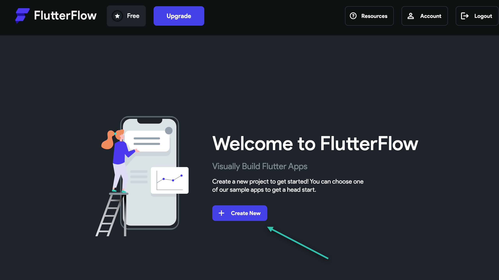
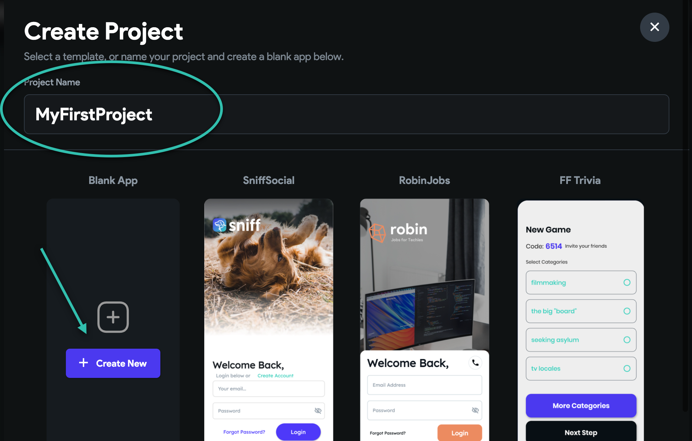
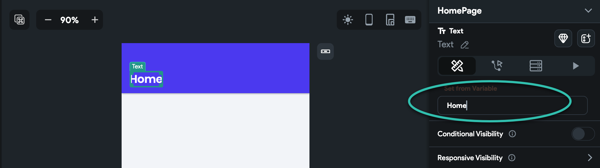
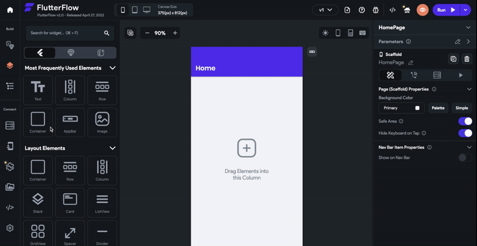
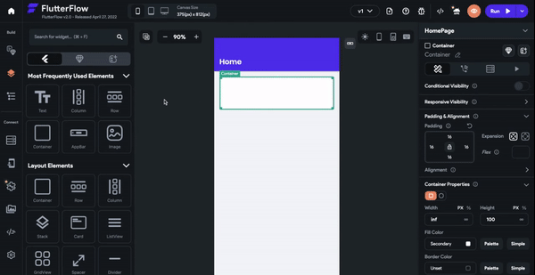

# Build Your First App

Welcome to FlutterFlow, we're so glad you're here! In this tutorial we'll show you how to build this app in less than 10 minutes!

**Create Your Project**
To create a new project, select** Create New.**

A popup will appear. Enter a name for your project (e.g. MyFirstProject) and then select Create New under the Blank App.

**Change The Page Title**
Click where it says Page Title.
From the Properties Panel on the right side of the screen, change the text from Page Title to Home.

**Style Your Container**
Select the Container widget and drag it onto your app canvas.​
Head to the right Properties Panel and locate the Padding &amp; Alignment section. Click the lock and then enter 16 where it says L. This will apply a padding of 16px on all sides.

Next, locate the Container Properties section. Under width select ∞ (the original value is set to 100). Under Fill Color Click on the white square. A pop-up will appear showing the color selector. Select Secondary BG and click Use Color.

In the Container Properties section, locate the Border Radius section. Click the lock and enter 8 where it says TL.

**Add Content To Your Container**

Drag a Column inside your container. Head to the Properties Panel. Under Padding &amp; Alignment, select the lock and enter 12.
Drag a Row inside the Column. Drag a Text widget inside the Row.
In the Properties Panel, change the text from Hello World to Active Projects. Scroll down to the Text Properties section. Click the dropdown under Theme Text Style and select Body Text 2.

