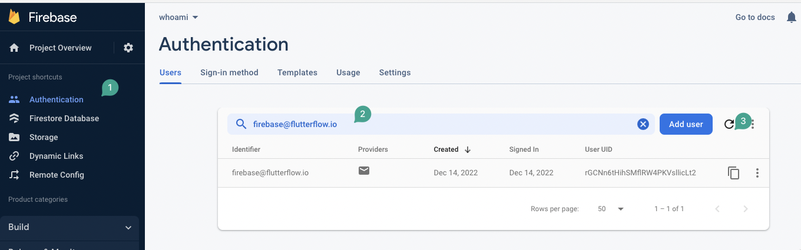

# Could not create an account as firebase@flutterflow.io to your firebase project, in CMS - content management

**If you believe all your configurations are correct, Or it was working before and you see this error now.**

1- Please go to firebase project > Authentication and search for firebase@flutterflow.io user​
2- Load the user by typing the firebase@flutterflow.io email and hit reload, After that you need to remove it from the authentication table

3- Please back to CMS. and refresh the page, now you should be able to see your database content

**Why this is happening?**When you connect more than 1 Flutterflow project to a firestore database and manage the data in more than one place. sometimes permissions got conflicted and when you open the CMS from project one, it works, but when you open CMS from the inside project two it does not work. so you need to remove the email and let it be created again.