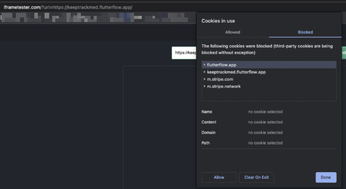

# Could we embed a Flutterflow web app into iFrames?

FlutterFlow web applications may not load within iframes due to their use of local storage. However, it is possible to load these applications within iframes by enabling third-party cookies from the subdomain of the FlutterFlow app.​
It is important to note that while this workaround may allow the application to load within an iframe, not all features may function properly. Additionally, it is worth noting that many reputable websites refuse to load within iframes as a security measure.Therefore, it is recommended to exercise caution when loading a FlutterFlow web application within an iframe and to thoroughly test all features to ensure proper functionality.