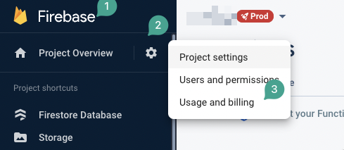
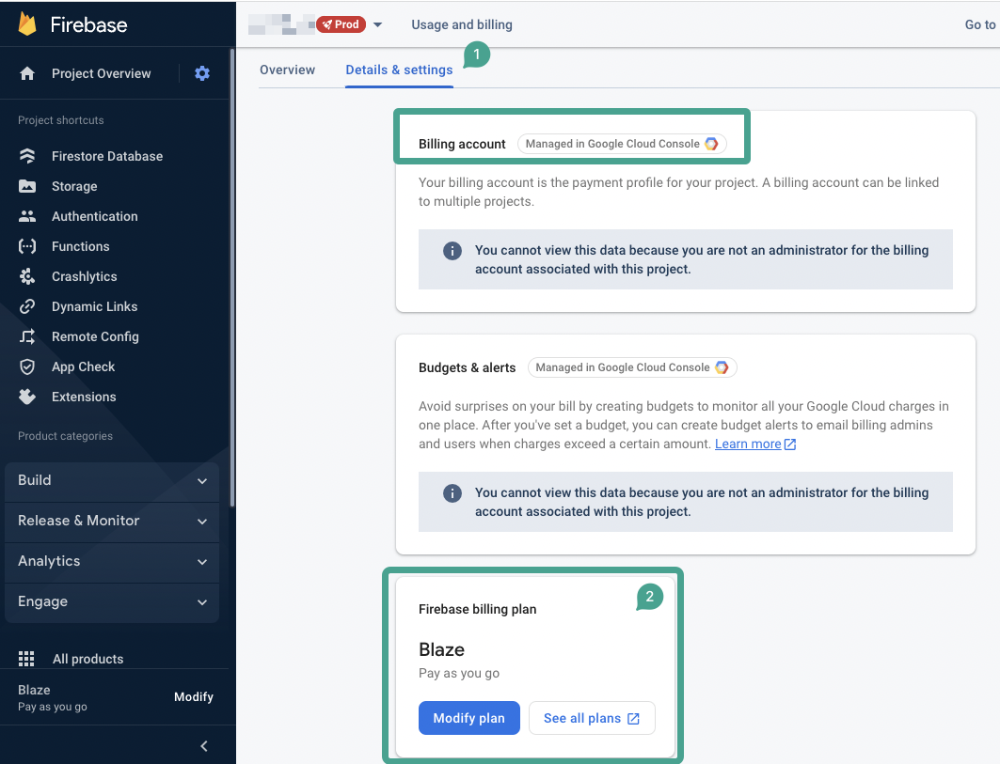
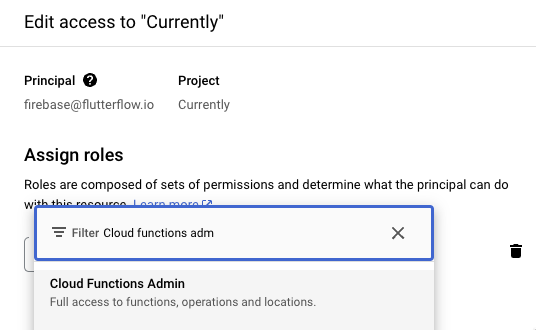

# Don't see Cloud Functions Admin in the Firebase Console

Issue: I am trying to add firebase@flutterflow.io as a Cloud Functions Admin, but I can't find the option to add this.

Background
Cloud Functions Admin permissions are required for several FlutterFlow features (e.g. Push Notifications). Adding this Cloud Functions Admin is optional, but not doing so will prevent you from using any functions that require Cloud Functions​
Adding the Cloud Functions Admin role requires that you have a Firebase Blaze plan.  

How To Add A Blaze Plan To Your Firebase Account

To activate the Blaze plan on your Firebase project and enable this permission, follow the steps below:

Open your Firebase project and navigate to the settings menu.

Select the Usage and Billing option from the settings menu.

In the Usage and Billing page, open the Details and Settings tab.

Confirm that an active Blaze plan is associated with your project and that your billing account is properly connected.​

Once these steps have been completed, you will be able to grant FlutterFlow permission to access and manage backend functions, allowing you to take full advantage of the platform's features.

​