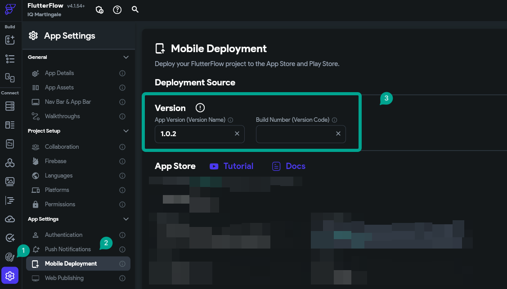

# Error: The bundle version must be higher than the previously uploaded version

Tip: Not sure which type of error your project has? Check out this article on how to identify your Codemagic error.

**What does this error mean?**
The error you are encountering occurs because the version and build number of the app you are trying to deploy are the same as the previously deployed version. Each new deployment must have a higher build number than the last one to be accepted by the Apple Store.

Error message
NSLocalizedFailureReason=The bundle version must be higher than the previously uploaded version.; or
"NSLocalizedDescription": "The provided entity includes an attribute with a value that has already been used"

How to resolve the issue
You need to ensure that the build number is higher than the last deployed version. In FlutterFlow, you can configure the build number to automatically increment with each deployment attempt.

**Here’s what to do:**

Check the latest version and build number uploaded to TestFlight. For example, if your last version was 1.0.1 with build number 12.

Navigate to **FlutterFlow &gt; Settings &gt; Deployment** and find the section where you specify the version and build number (see image below this section).

You have two options:

**Option 1:** Keep the version the same and leave the build number field empty, allowing FlutterFlow to automatically increment it for you.

**Option 2:** Manually increment the build number by 1. For example, if the last build number was 12, change it to 13.

If manually incrementing the build number does not resolve the issue, try incrementing the version number as well. For instance, change it to 1.0.2 and leave the build number field empty, then attempt the deployment again.

Preventing Future Errors 
To avoid this error in future deployments:

If you prefer to **manually** increment the build number, be sure to increase it by one (1) before each new deployment.

Alternatively, leave the build number field empty altogether, allowing FlutterFlow to handle the increment automatically.

The issue was not resolved
If this does not resolve the issue, contact FlutterFlow Support at support@flutterflow.io