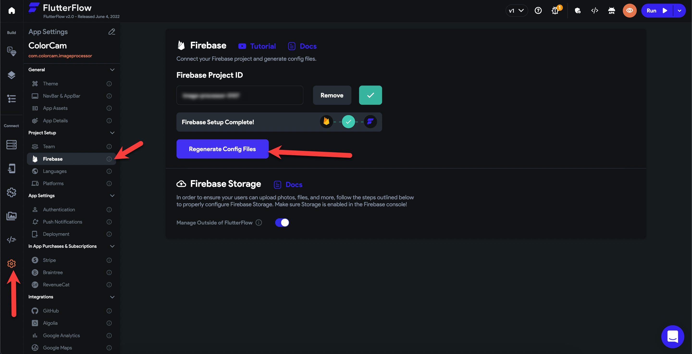

# Execution failed for task ':app:processReleaseGoogleServices'.

Tip: Not sure which type of error your project has? Check out this article on how to identify your Codemagic error.

**What does this error mean?**
This error usually means that there is some mismatch with the package name and that it needs to be checked.

**Full error message** 
```
FAILURE: Build failed with an exception.* What went wrong:Execution failed for task ':app:processReleaseGoogleServices'.&gt; No matching client found for package name '[app.app.app]'
```

**How to resolve this issue?**
To resolve this issue, please follow the following steps.

You'll need to Regenerate the config files from FlutterFlow. To do this, open your app in **FlutterFlow** and then click on **Settings** **&gt;** **Firebase**.​


Here, Click on the **Regenerate Config Files **button, Enter the new package name and then Click on **Generate File.**​


This issue should now be resolved. You can now re-deploy to confirm that the issue has been fixed.

**Issue was not resolved after following the given steps**
If you are deploying from FlutterFlow and still getting this error after following all the steps outlined above, then please report this issue to support via Chat or Email at support@flutterflow.io.

