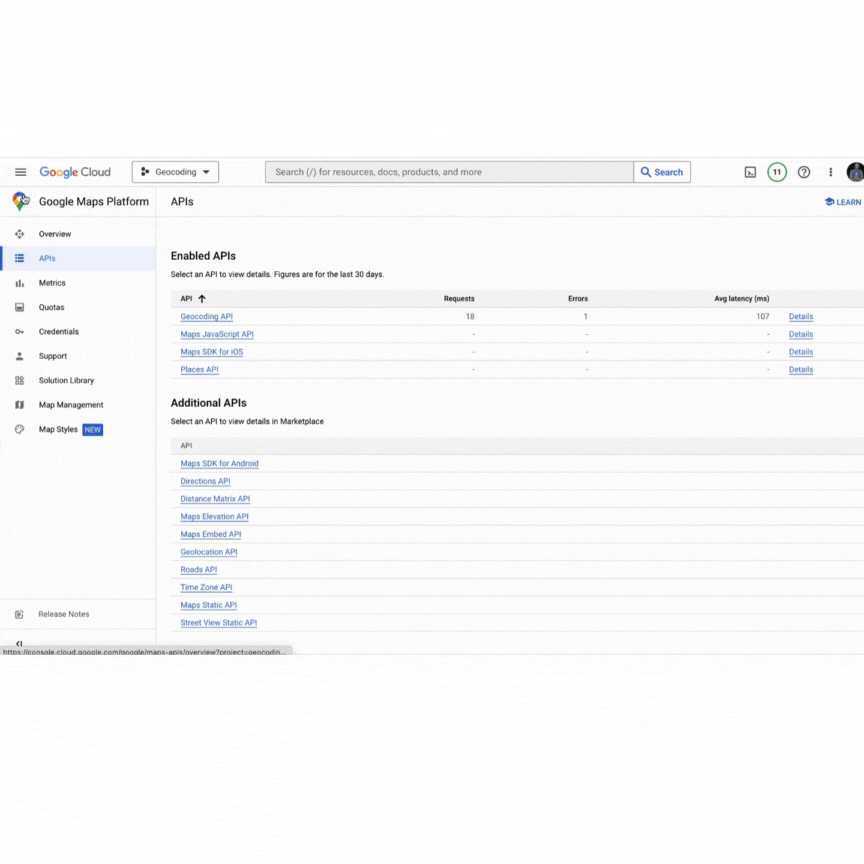
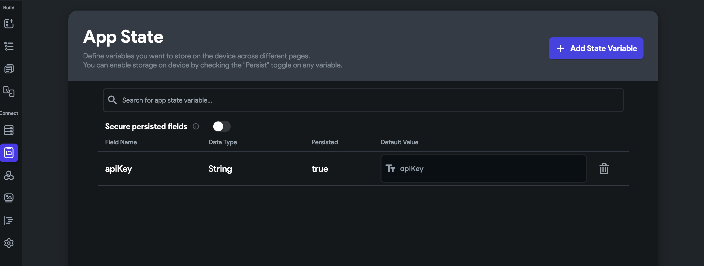
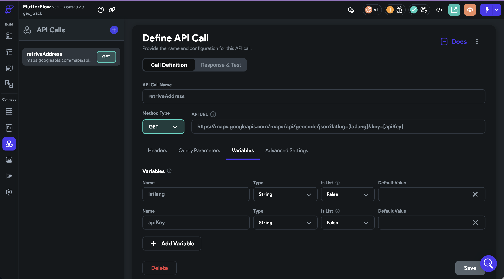
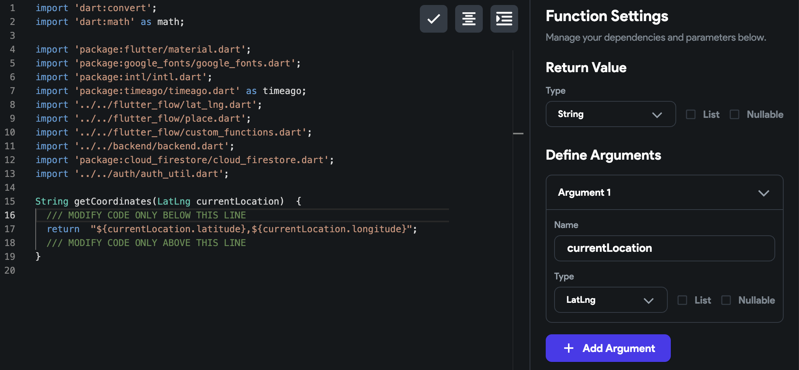
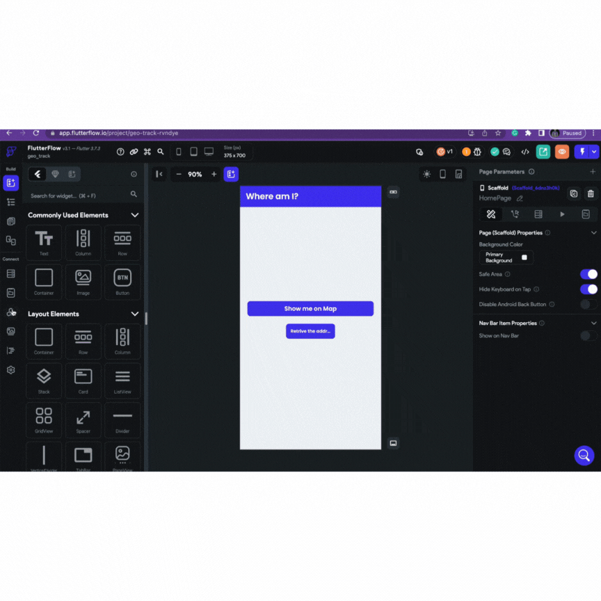
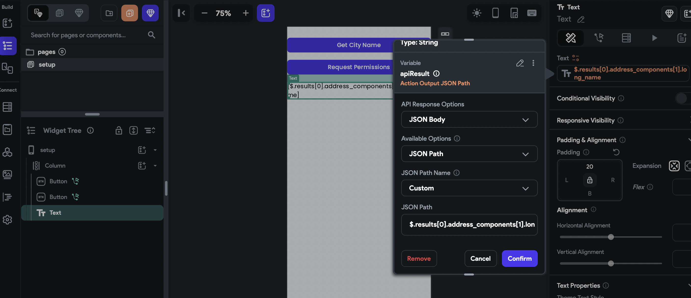
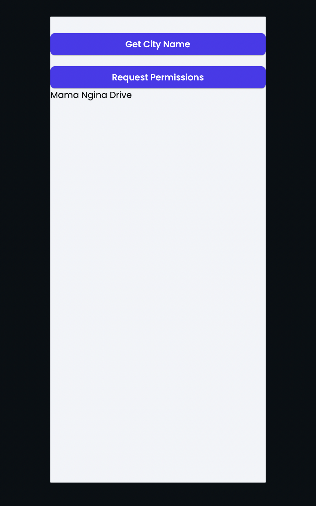
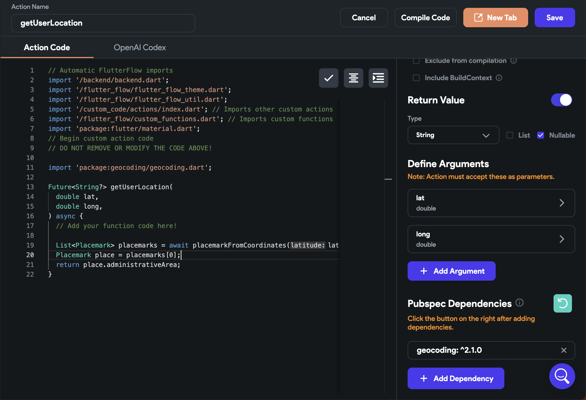
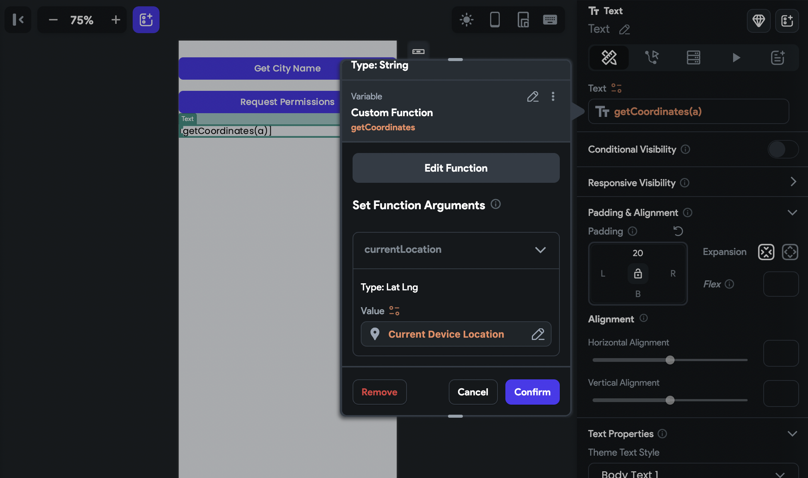

# Get Address From Current Device Location

Use Case
FlutterFlow enables users to get the current device location or make calls to google maps API were you can get location meta data and details. You may want to get the location name to display in your FlutterFlow project , from the current device location or from an API call. This articles details a step by step instructions on how to achieve this.
Background
You can get formatted addresses from latitude and longitude in a few ways.

Using the google maps API `https://maps.googleapis.com/maps/api/geocode/json?latlng=[latlang]&amp;key=insertAPIkeyhere`

Using dart package `Geocoding`

We'll show you step-by-step how to set this up in FlutterFlow.
Sample Project
We've created a sample project to demonstrate how to build this in FlutterFlow:
https://app.flutterflow.io/project/geo-track-rvndyeKeep reading for step-by-step instructions to learn how you can build what we have created in our sample project.

Using Google Maps API
To use the Google Maps API to get a user's current device location:

Visit google cloud platforms and enable Maps for your project application 
Here are detailed instructions on how to do this. Enabling the map's API

2. Add the API key to the local App State

3.  Set up and configure your APIs
- Navigate to API calls
- Create an API call 
- Ensure you add the base URL and set the request method to Get
-  Under the variables section, create 
- create a variable name that latlng, set the data type to a string
- create another variable name it apiKey, and set the data type to string

Here are detailed instructions on how to do this.
-  Creating API Call
- Adding API call query 

**4. Create A Custom Function To Convert The Device Location To A String**To convert the current device location from global properties to string, create a custom function that will return a string.

The custom functions take one parameter of type LatLng which is the type of the `current device location`.

This Custom function will return a string of latitude and longitude to be passed to our API variables.

In the UI builder create a button and set an action the performs a backend call

5. Head back to API's run and test if the API is working well.
From the result create a JSON path.JSON path makes it possible to retrieve specific data out of the whole JSON response.

5. You can now show the City name in the UI builder by passing the JSON Path as a   variable to the text. 
To target a specific data we will pass array index of the long name to the json path

`$.results[0].address_components[1].long_name`

Head to JSON paths to get more detailed instructions on how to create JSON paths.

You should have such results.
Using the Geocoding package
You also can use a custom action that receives the user's current device location from the global properties as parameters and relies on a dart plugin like (geocoding) to convert the coordinates to the city name. ** **
Here is a sample of the custom action. 

Set the text variable from the custom action and pass the current device location.​
To learn more about adding dependencies to your FlutterFlow project, read this article https://intercom.help/flutterflow/en/articles/7152626-adding-dependencies-in-pubspec-yaml-file-for-entire-project .

