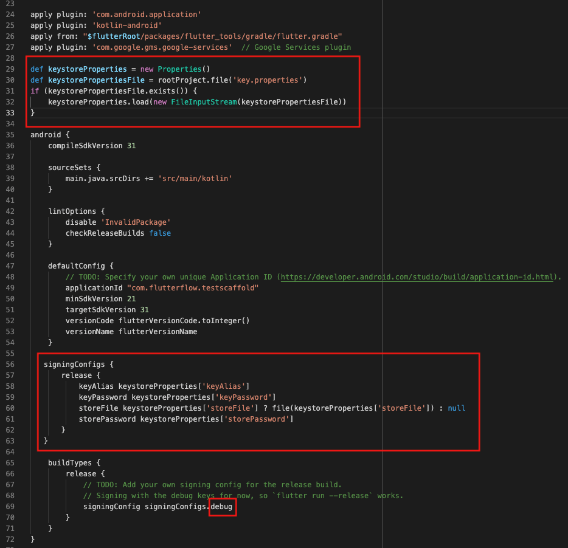

# Google Play failed to upload artefacts. The Android App Bundle was signed with the wrong key. Found: SHA1: XX:XX:XX:XX. Expected YY:YY:YY:YY

Tip: Not sure which type of error your project has? Check out this article on how to identify your Codemagic error.

**What does this error mean?**
One of the most common causes of a publishing error when deploying to the Google Play Store is attempting to deploy using the wrong Keystore file.

**Full error message**

```
Google Play failed to upload artefacts. The Android App Bundle was signed with the wrong key. Found: SHA1: XX:XX:XX:XX. Expected YY:YY:YY:YY 
```

**How to resolve this issue?**
If you are not using GitHub, contact support@flutterflow.io​
**Verify That The Correct Keystore File Was Submitted For Signing**

To create a new keystore, please run the following commands in your Integrated Development Environment`keytool -genkey -v -keystore ~/upload-keystore.jks -keyalg RSA -keysize 2048 -validity 10000 -alias upload`
If the application was already deployed and the previous keystore was misplaced, contact Google Support for further assistance.

**Verify That Build.Grade File Was Correctly Modified**

It is helpful to check the build.gradle file was modified to include the changes illustrated in the Google Play deployment documentation.

**Verify your application was submitted in Release Mode**
Debug mode is when the application is still in development. In debug mode, the source code is not optimized for production, and the performance of the application might not be optimal. The application should be signed in Release Mode when it is ready to be published to the app stores. Signing the application in Release Mode will result in code optimization and much better application performance. To check:

Check whether the application is signed in Release Mode instead of Debug Mode
If you see debug mode, you need to use these steps to fix it 


**The issue was not resolved**
If you are deploying from FlutterFlow and still getting this error after following all the steps outlined in our documentation, then please report this issue to support via Chat or Email at support@flutterflow.io.​
