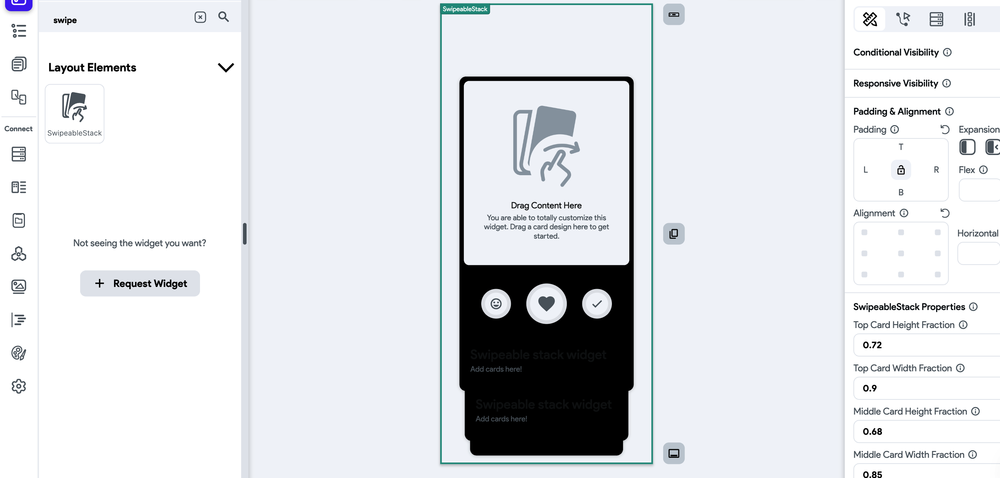
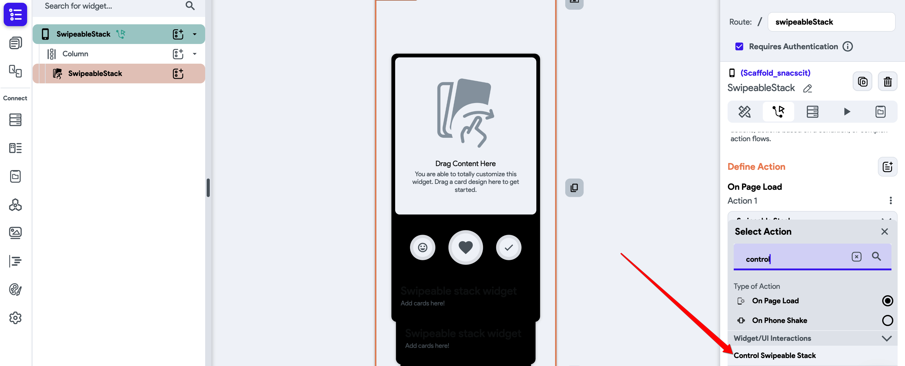
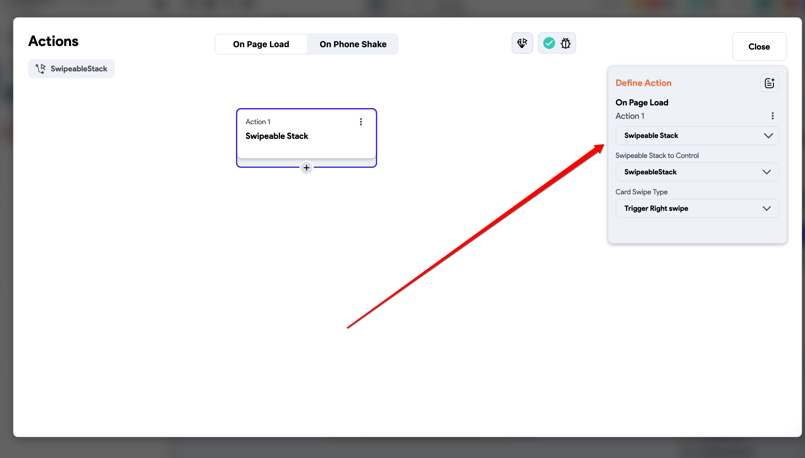
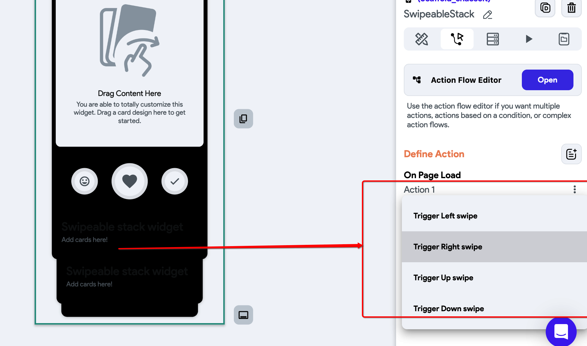

# How To Create An SwipeableStack In FlutterFlow

**WHEN TO USE A SWIPEABLESTACK WIDGET **A swipeable stack widget is typically used when you want to create a user interface where multiple cards or elements are stacked on top of each other, and the user can swipe horizontally to navigate through them. This pattern is commonly seen in apps that display a series of cards or pages that users can easily navigate through by swiping left or right. Some common scenarios where you might use a swipeable stack widget include:

Tinder-like card swiping: When you want to implement a UI similar to the popular dating app Tinder, where users can swipe left or right to like or dislike cards, a swipeable stack widget can be used.

Image carousel or gallery: If you have a set of images or content that you want to display one at a time and allow users to swipe through them horizontally, a swipeable stack widget can be a great choice.

Onboarding screens: In apps with onboarding processes that introduce the app's features or functionality, a swipeable stack can be used to present different screens to the user, one at a time, with the ability to swipe through them sequentially.

Content exploration: If your app has content items, such as articles or products, that users can explore, a swipeable stack can provide an engaging and intuitive way for users to navigate through the content.**NB**: Keep in mind that while a swipeable stack can offer an appealing and interactive user experience, it's essential to consider the context of your app and ensure that this navigation style aligns with your overall design and usability goals. Additionally, be mindful of performance implications, especially if you have a large number of elements in the stack, as rendering multiple widgets with animations can impact performance on lower-end devices.***Widgets***

SwipeableStack Widget
***Action (User Interaction)***

Control SwipeableStack View
Step 1: ​
Add a **Swipeable Widget** to the canvas or displayed screen.Step 2: Add an action to the scaffold, on '**page load**'
Step 3: Under, '**define actions**', select '**Control Swipeable Stack**' ​
Step 4: Select the Swipeable Stack type among the options shown in the attached image.
1. **Trigger Left Swipe**: This will initiate a swipe to the left
2. **Trigger Right Swipe:** This will initiate a swipe to the right
3. **Trigger Up Swipe**: This will initiate a swipe upwards
4. **Trigger Down Swipe**: This will initiate a swipe downwards. ​
That way it will proceed to use the selected trigger type. 

**Do You Have Questions?**
If you have any questions, please reach out to support via Chat or Email at support@flutterflow.io.