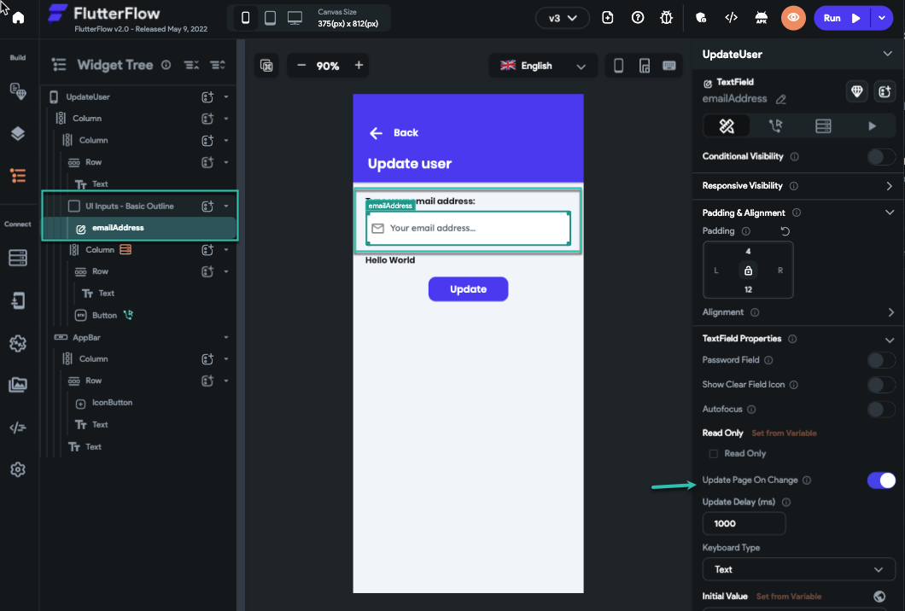
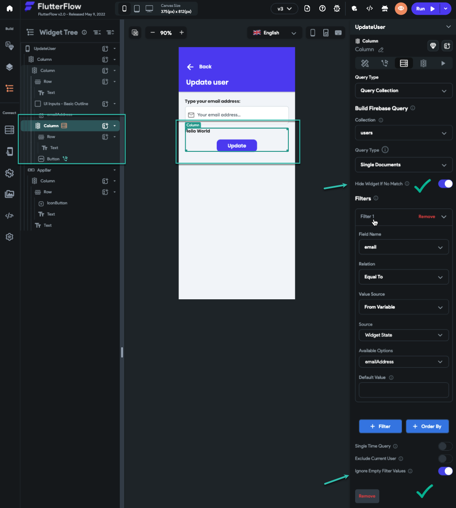
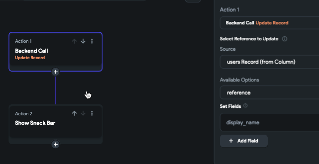

# How to: Take an email from textField [ user input ] and update the same user record?

Sometimes you need to update/delete a record and the record related to the user choice. for example, you want the user to type an email address and if a user exists with that email address you want to update that user or maybe put the user reference on a document.But how? as we do not have any action that does a query.

Trick: we need to load the document before any action, so how?As a pre-requisite you will need to:

Complete Firebase setup

Create a Firebase collection

Have some users documents in your database1: We need a textField widget to take the email from the user

we need to turn on the Update page on change functionality so this way every time users type a character the page will be refreshed and we can access the value.​
2: now we need another widget to show the result and the button that we want to use to raise the action.this widget should be hidden when we do not have any results. the query will take care of that.so we do a single query on the widget and make sure to turn on the Hide widget if no match. simply here we are hiding the entire widget when we do not find any user with that email.
so if this widget is shown it means we find the user and we have a result on our query. now let's go for the action on the button

3: in the action panel, we just do an update on the query result that is a user document. and after that, we show a snack bar

That's it.* You can instead turn on the Update page on change for the text field. use localState and a button to set the localState value from textField. and use the localState value to filter your query.

You can open this project [ https://app.flutterflow.io/project/flutterflow-adcdi2 ] page "UpdateUser" and see how we did this. replicate the process then.

.
​