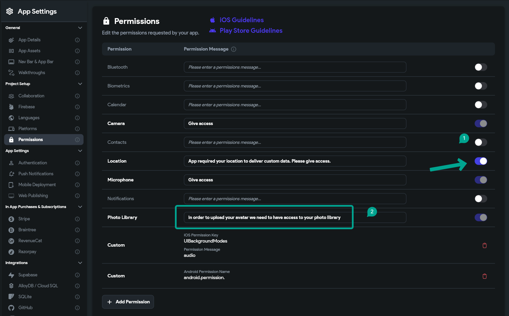
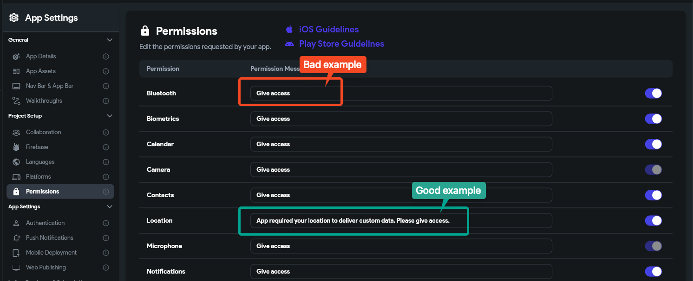

# Missing Purpose String in Info.plist

**Full Error Message**
```
ITMS-90683: Missing Purpose String in Info.plist - Your app‘s code references one or more APIs that access sensitive user data. The app‘s Info.plist file should contain a [permission] key with a user-facing purpose string explaining clearly and completely why your app needs the data. If you're using external libraries or SDKs, they may reference APIs that require a purpose string. While your app might not use these APIs, a purpose string is still required.
```

Quick Summary of the Solution

The error indicates that your app needs to provide clear explanations for why it uses certain data. To resolve this issue:

**Navigate to Settings**: Start by going to the settings menu in FlutterFlow.

**Adjust Permissions**: Click on 'Permissions'. Here, you need to either:

Add clear descriptions for why each permission is needed. For instance, if your app accesses the photo library, include a purpose string like: "We need access to your photo library to upload images directly from your device."

Ensure all necessary permissions your app requires are enabled.

Implementing transparent fixes like these helps build trust and smoothens the process for App Store approval.
More on the **`ITMS-90683`** Error 
The **`ITMS-90683`** error occurs when your app's code references APIs that require user permission to access sensitive data, but your **`Info.plist`** lacks the necessary purpose strings. These strings are essential for informing users about why your app needs access to certain data, contributing to a trustworthy user experience. This requirement applies even if your app indirectly references these APIs through external libraries or SDKs.


How to Fix the Error
To resolve this issue, you need to update your **`Info.plist`** file with the missing purpose strings for each permission your app requires. Here's a step-by-step guide:

**Identify Required Permissions**: Review your app and note down all the features that require access to sensitive user data, such as the camera, microphone, location services, etc.

**Navigate to Setting &amp; Integrations**: In your project settings, find the section labeled Permissions. This is where you'll define and explain the permissions your app requires.

**Add Permissions and Purpose Strings**: For each required permission, add an entry in your **`Info.plist`** with the appropriate key and a detailed description of why your app needs this access. The description should be clear, user-friendly, and comprehensive, explaining not just that your app needs this access, but how it will be used to enhance the user's experience.
For example, if your app needs microphone access, you might add the **`NSMicrophoneUsageDescription`** key with a value like "Our app requires microphone access to allow you to record audio notes within the app."

**Review Guidelines**: Before finalizing your purpose strings, review the guidelines provided by Apple for requesting access to protected resources. Ensure your purpose strings align with these guidelines to avoid submission issues.

**Test**: Before submitting your app, test it to ensure that the permission prompts appear as expected and that the purpose strings are displayed correctly to the user.

**Submission**: Once you've added all necessary purpose strings and tested them, you can resubmit your app for review.

Why It's Important
Providing clear and honest purpose strings is not just about compliance; it's about building trust with your users. By transparently explaining why your app needs certain permissions, you encourage users to grant those permissions, enabling them to fully experience your app's features.


Remember, privacy is a critical concern for many users, and how you handle their data can significantly impact their perception of your app. By addressing the ITMS-90683 error thoughtfully, you demonstrate your commitment to user privacy and trust.​


​​