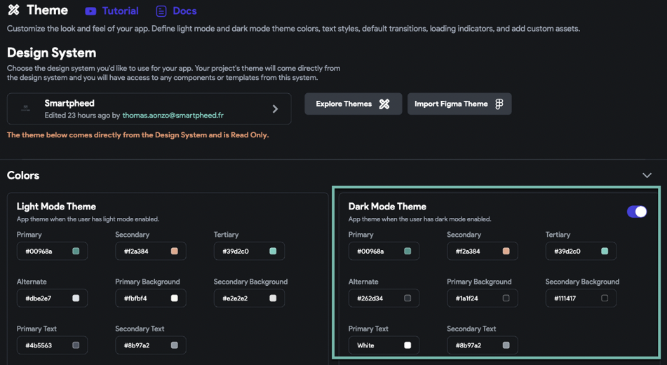
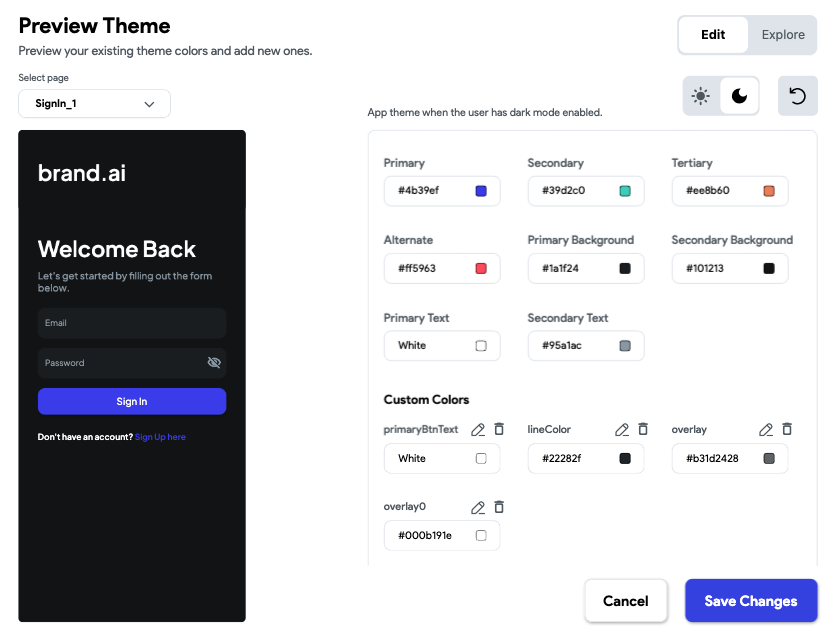

# My app colors aren't correct when running my application on a real device

Issue Overview
You are testing your application on a phone and the colors are not appearing as expected.

Common Causes
Real devices have their own configurations in terms of theme and color. Devices typically have light mode, dark mode, or automatic (which switches between light and dark mode). For example, if your device is set to dark mode - your application will display in Dark Mode.

This issue typically arises when Dark Mode is enabled, but set up has not been completed or conflicting colors have been selected.

Basic Troubleshooting Steps
Step 1: Check If You Have Dark Mode Enabled In Your App
Head to **Settings &gt; Theme** and check if the Dark Mode toggle is turned on. If it is, you have dark mode enabled (example below).

Turn dark mode off and redownload your application. If it works as expected, the Dark Mode Settings are the issue.​

To correct this issue you can:

Turn dark mode off

Update your colors so that the Dark Mode Theme is complete / visible by the user

You can preview how the colors will work by selecting the **Explore Themes** button in the Theme Section (example below)

After you have completed these steps, your colors should appear as expected.

​