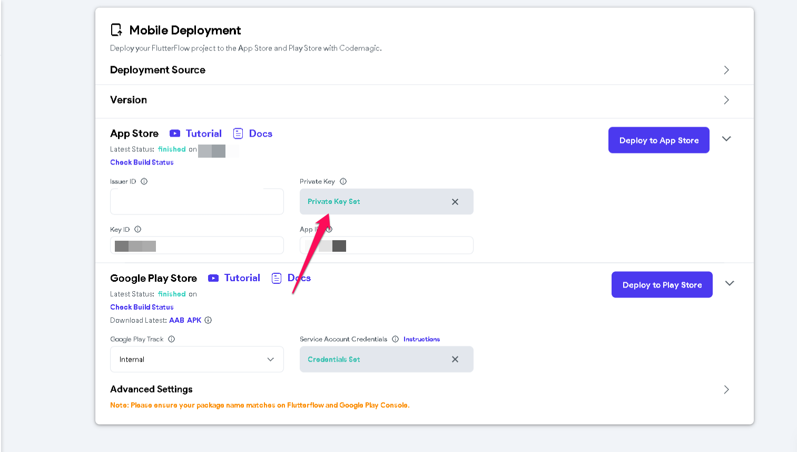

# Provided value is not a valid PEM encoded private key

Full Error Message

```
Failed Step: Fetch Signing files usage: app-store-connect [-h][--long-stream {stderr,stdout}][--no-color][--version][-s][-v]{app-store-version-localizations,app-store-version-submissions,app-store-versions,apps,beta-app-review-submissions.beta-build-localizations,beta-groups,builds,create-bundle-id,create-certificate,create-profile,delete-bundle-id,delete-certificate,delete-profile,fetch-signing-files,get-bundle-id,get-certificate,get-latest-app-store-build-number.get-latest-testfligjt-build-number,get-profile,list-builds,list-bundle-id-profiles,list-certificates,list-devices,list-profiles,publish,register-device,review-submission-tems,review-submissons}..app-store-connect: error: arugment --private-key: Provided value is not a valid PEM encoded private key 
```
** What does this error mean?**
The private key submitted in FlutterFlow is not valid or permitted.**How can I resolve this error?**Navigate to **App Settings** > **Mobile Deployment > App Store **Please reupload the private key for App Store once more ​
If the app store configuration was not set up, here are step-by-step instructions on how to do so **This did not resolve the reported issue.** Please contact support@flutterflow.io for further assistance