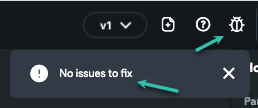

# Resolve Issues Running Code Locally After Exporting My Code / APK

Introduction
If you're facing issues with APKs not functioning as expected after downloading from FlutterFlow, a few preliminary steps can help ensure smoother operation and integration with Firebase authentication services.

This guide will walk you through resolving any project issues within FlutterFlow, saving your changes, and properly rebuilding the APK. Additionally, running the APK locally can reveal any underlying compiler errors, providing clear insights for further troubleshooting. 

Follow these steps carefully to address and rectify common pitfalls in the APK generation process.

Resolution Steps
Before downloading APK again, in Flutterflow:

Resolve any issues in the project.

Save the Project before building the APK (Ctrl/Cmd + S).

Rebuild and download the APK.​

Download the code/APK and run it locally to view any compiler errors. Make sure you run any necessary commands in the terminal. Here are instructions on how to do this.

**​Note when you download your code and build directly from your local machine vs. APK: **Some features, like Google sign-on, may not work when you release and build from your local machine. In this scenario, you'd need to add your "SHA1" key to Firebase + your Android app. 

​Need help with this? Check this video on YouTube.

