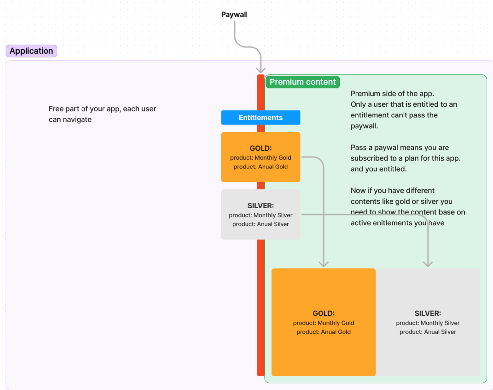
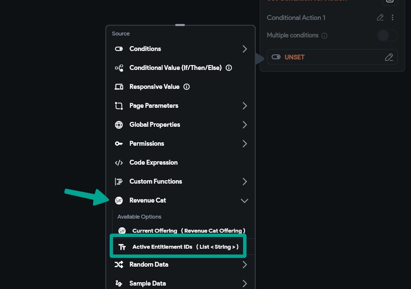
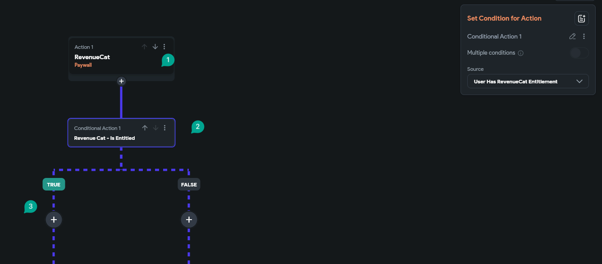
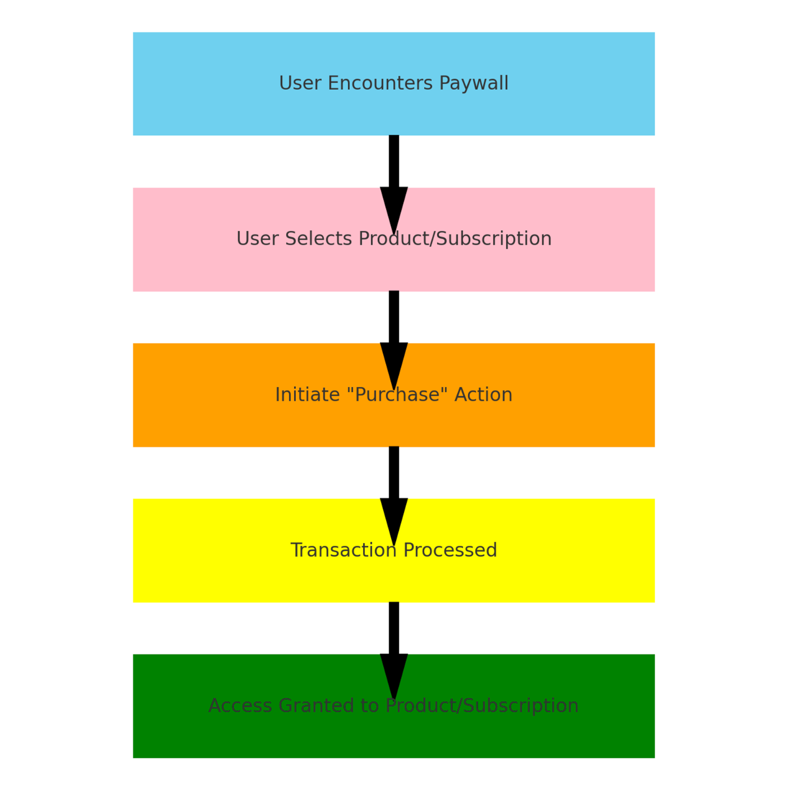
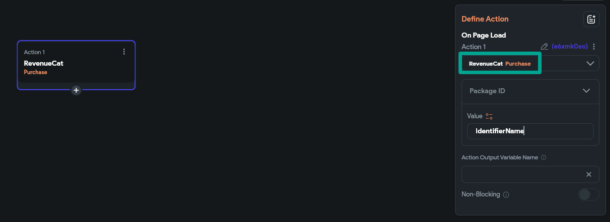

# RevenueCat for Subscription and One-Time Payments in FlutterFlow – PayWall

In the evolving landscape of mobile applications, **in-app purchases** and **subscriptions** represent a significant revenue stream. RevenueCat emerges as a powerful tool to simplify the management of these monetization strategies, particularly when integrated with platforms like **FlutterFlow**. This article delves into how RevenueCat orchestrates paywalls for both subscription and one-time payment models, ensuring seamless entitlement management across different user scenarios.​
Understanding RevenueCat's Role
RevenueCat serves as a **middleman** between your app and the app stores (Google Play and Apple App Store), managing in-app subscriptions and purchases. By abstracting the complexities of store-specific APIs, RevenueCat provides a unified interface to track subscription revenue, handle user subscriptions, and manage in-app receipts.

Preparing Your App
Before diving into RevenueCat's implementation, ensure your app is deployed on Google Play Store and Apple App Store. FlutterFlow facilitates this in the "Settings and Integrations &gt; Mobile Deployment" section. It's crucial to define your subscriptions and one-time purchases in both app stores prior to integration with RevenueCat.

Configuring Products in RevenueCat

**Subscriptions**: In RevenueCat, subscriptions are set up as auto-renewable products. Each subscription needs a unique identifier and should be added under the "Product Setup" section. This includes defining the subscription details like duration, price, and available tiers.

**One-Time Purchases**: Similarly, one-time purchases are configured in RevenueCat as non-consumable products. Each one-time purchase requires a unique identifier, allowing you to track and manage these transactions separately from subscriptions.

Entitlements and Offerings
**Entitlements** in RevenueCat help in determining user access to content or features based on their purchases. For example, you might have an entitlement named "PremiumAccess" that unlocks additional app functionality for subscribed users.
Offerings and their associated packages describe the actual products available for purchase. They represent the bridge between your app's paywall and the products defined in RevenueCat, ensuring users are presented with the correct options for subscriptions or one-time purchases.​​
If you have different types of products, like subscription and one-time payment products, you may need to check the list of the user's entitlements to see if it contains a specific entitlement (instead of using the paywall action).​​**Why? **Even if the user bought a one-time product (i.e., not a subscription), a paywall will be passed. ​If you allow users to purchase items like tokens, buying tokens will enable users to bypass the paywall. This purchase adds a one-time product to their entitlements. The paywall treats subscriptions and one-time products the same, accommodating users who prefer to grant access through a single purchase.​​
Implementing the Paywall in FlutterFlow
The paywall is the pivotal point in your app where users decide to make a purchase or subscribe. In FlutterFlow, you can design a paywall page or modal displaying the offerings fetched from RevenueCat. Utilizing FlutterFlow actions like "Check Subscription Status" and "Initiate Purchase," you can manage user interactions with the paywall, guiding them through the subscription or purchase process.

In Flutterflow Paywall is an action, and the result of the action is a boolean value, If you add a condition after the paywall action Flutterflow will set the condition automatically to the paywall result, #3 if the user has entitlement then we do the next actions, If not we could show a modal for users to subscribe or navigate to another page to let them subscribe

In Flutterflow, a paywall is an **action** that produces a **boolean** value. When you follow the paywall action with a condition, Flutterflow automatically applies the result of the paywall to this condition. If the user has entitlements, subsequent actions are triggered. Some other options are to:

Display a modal prompting the user to subscribe

Redirect users to another page for subscription purposes​​

Managing User Transactions
After a user selects a product or subscription, the **Purchase** action in FlutterFlow initiates the buying process. 

RevenueCat handles the transaction with the app store, ensuring secure and reliable payment processing. Post-purchase, the user's entitlements are updated, granting them access to the paid content or features.

If a user needs to restore previous purchases, the **Restore Purchase** action in FlutterFlow facilitates this process. By implementation this action, you ensure users can reclaim their subscriptions or purchases across devices or after reinstalling the app.​
The outcome of the action is a string labeled as "paymentId." You can examine this string in the action's output via the source menu. 

**One important check:** ensure the "paymentId" is present and not null. If this condition is met, you can proceed with the actions you've planned for after a successful payment.

Conclusion
Integrating RevenueCat with FlutterFlow for managing subscriptions and one-time payments offers a robust solution to monetize your app effectively. By understanding the configuration of products, entitlements, and the paywall mechanism, developers can provide a seamless user experience, encouraging purchases while simplifying the management of in-app revenue streams. For detailed guidance on setting up RevenueCat and FlutterFlow, refer to the FlutterFlow documentation and the RevenueCat SDK documentation.​​
Additional Resources

FlutterFlow YouTube Channel for tutorials and tips.

RevenueCat Non-Subscription Purchases Documentation for insights into managing one-time payments.

FlutterFlow Community for support and discussions with other developers.

