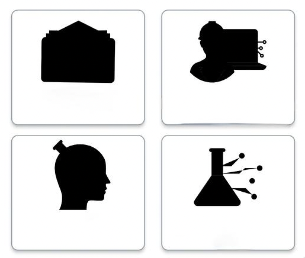

# SVG images work on web, but don’t have colors on a real device

Potential Causes Of This Issue
There could be a number of reasons why your SVG images are appearing without color when viewed on a mobile device. Some potential causes include:

The color mode of the SVG file might not be set correctly. Some mobile devices may not support certain color modes, such as CMYK, and may only display the image in grayscale.

There might be a problem with the way the SVG file is being embedded in your app. Make sure the file is being correctly linked and referenced in your code, and that there are no errors in the file path.

There could be a problem with the device's display settings. Ensure that the device's color filter is turned off.

The SVG file may be missing the necessary color information. Check that the SVG file has a fill or stroke attribute with a value set.

The SVG file might have an attribute that is set to display: none; that's why it's not showing.

Troubleshooting This Issue
To troubleshoot the issue, you could:

Try another SVG image and see how they are shown. If you exported your SVG images, make sure to change your method or use another software.

Open the SVG file in a browser on the mobile device to see if it displays correctly. 

Open the file in a text editor to check if the fill or stroke attributes are set correctly.

Use a different SVG viewer app on the mobile device to see if the problem is specific to the app you're using.

