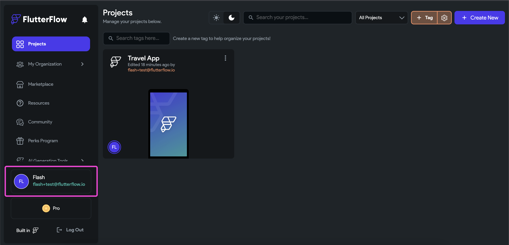
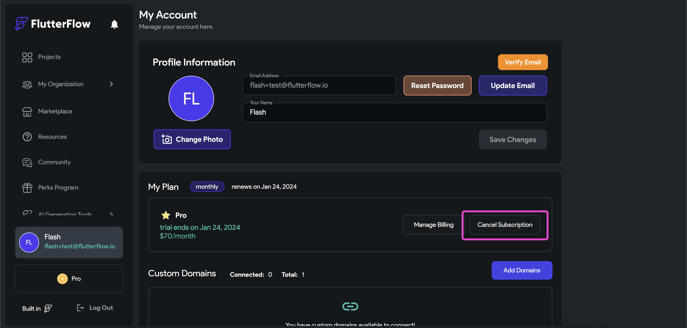
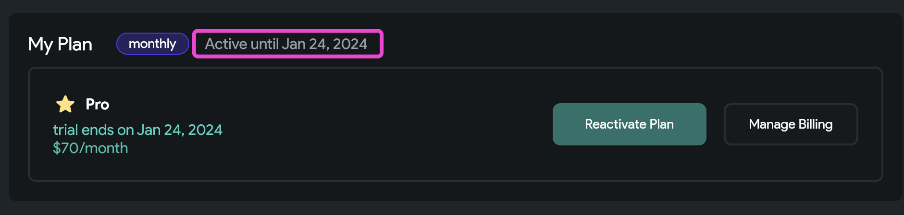

# Cancel FlutterFlow subscription

You can cancel your FlutterFlow subscription at any time. After cancelation, you will continue to have access to paid features until the end of your current billing cycle.

## Steps to Cancel Your Subscription

1. Log in to FlutterFlow and click your name in the bottom-right corner to access your **My Account** page.

   

2. In the **My Plan** section, click **Cancel Subscription**.

   

3. Complete the cancelation survey and click **Cancel Subscription** to confirm.

   A confirmation message will appear after cancelation.

:::note
Your account will remain active with paid features until your current billing period ends. After that, your account will automatically switch to the free plan.
:::

You can verify the cancelation by checking the **My Plan** section, where it will display **Active until [x date].**

   
