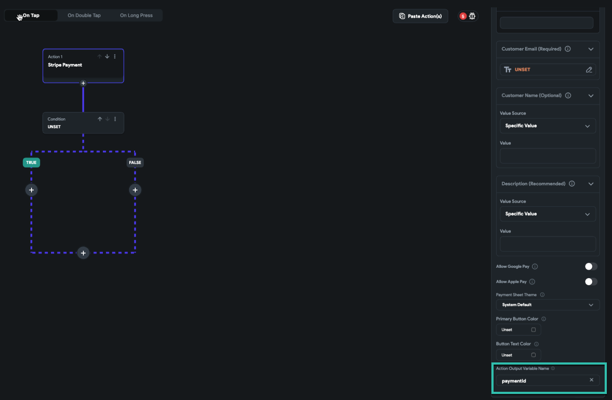
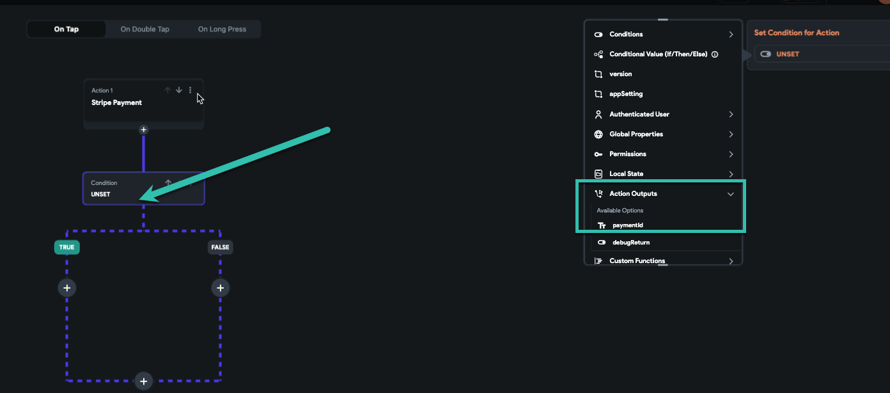

# Check Stripe Payment Status

You can verify whether a Stripe payment succeeded or failed using action output variables in FlutterFlow.

**Using Action Output Variables**

FlutterFlow actions allow you to name an output variable that stores the return value after execution. This is useful for tracking the status of operations, including payments.

**Default PaymentId in Stripe Actions**

For Stripe payments, FlutterFlow assigns a default output variable named `paymentId`. This variable holds the ID returned by Stripe after processing the payment.

    

**Checking Payment Status**

After the Stripe payment action runs, check if `paymentId` is set and not empty. 

    - If `paymentId` is not empty, the payment was successful.
    - If `paymentId` is empty, the payment failed.

    

    

**Actions Based on Payment Result**

    **On Successful Payment**

        - Display a confirmation message (e.g., snack bar).
        - Navigate users to a success screen.
        - Update the database, send confirmation emails, or perform other success actions.

    **On Failed Payment**

        - Prompt the user to try again.
        - Reset payment input fields.
        - Provide feedback to guide users through retrying the process.

    By using action outputs, you can build reliable and responsive payment flows in your app.

    