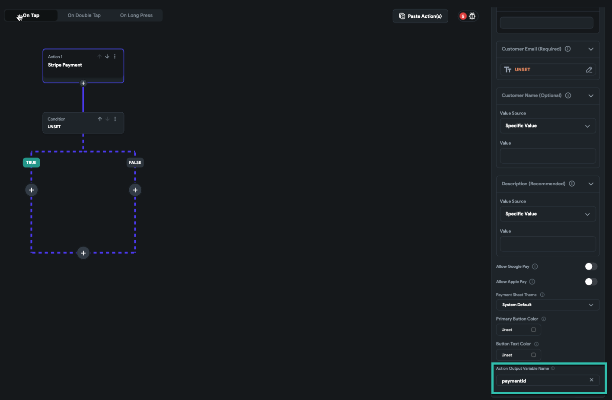

# How to Check if a Stripe Payment Succeeds or Fails

## Understanding Action Output Variables in FlutterFlow

FlutterFlow actions come with a feature that allows you to name an action output variable, which holds the return value after the action's execution. This functionality is crucial in tracking the status of operations, including payments.​

## Default PaymentId in Stripe Actions

In the context of Stripe payments, FlutterFlow assigns a default variable named "**paymentId**" to the action output. This variable is instrumental in discerning the payment's status.​

## ​Checking Payment Status

When a Stripe payment action runs, the next immediate step is to verify if the "paymentId" is set and non-empty.

A non-empty "paymentId" signifies a successful transaction, as it indicates that Stripe has returned a valid identifier for the processed payment.

## Subsequent Actions Based on Payment Status
Upon confirming the payment status, you can trigger the corresponding actions:

- ### Indicating Successful Payment to Your Users:

    - Display a confirmation message using a snack bar.

    - Navigate the user to a success screen with a thank-you message.

    - Perform any other success-related actions such as updating the database, sending confirmation emails, etc.

- ### Indicating Failed Payment to Your Users:

    - Prompt the user to attempt payment again.

    - Reset the payment inputs and guide the user through the payment process once more or let them try again if they want to.

    - Provide feedback on what might have gone wrong to improve user experience.

FlutterFlow's capability to handle action outputs, particularly with payment systems like Stripe, gives developers a powerful tool to create seamless and responsive payment flows in their apps. By following the steps outlined above, you can ensure that your app appropriately responds to the outcome of each Stripe payment, enhancing the user's experience.​

​​