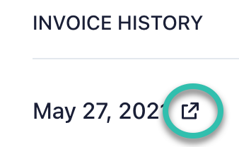

# Payment Failed Update Credit Card

If your payment fails, you can update your credit card information and retry the payment.

:::tip
The most common causes for failed payments are insufficient funds, payment blocked by the credit card provider, or an expired card. If your payment fails, check with your credit card provider for specific details.
:::

To update your payment method for an open invoice:

    - Open **My Account**.

    - Select **Manage Billing**.

    - Scroll to **Invoice History**.

    - Locate the failed invoice (it should be at the top) and click the icon.

        

    - Enter your updated payment information.

        Once the transaction is successful, your system access will be restored.
