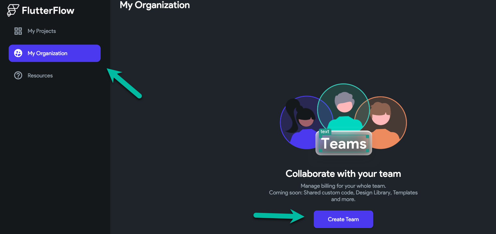
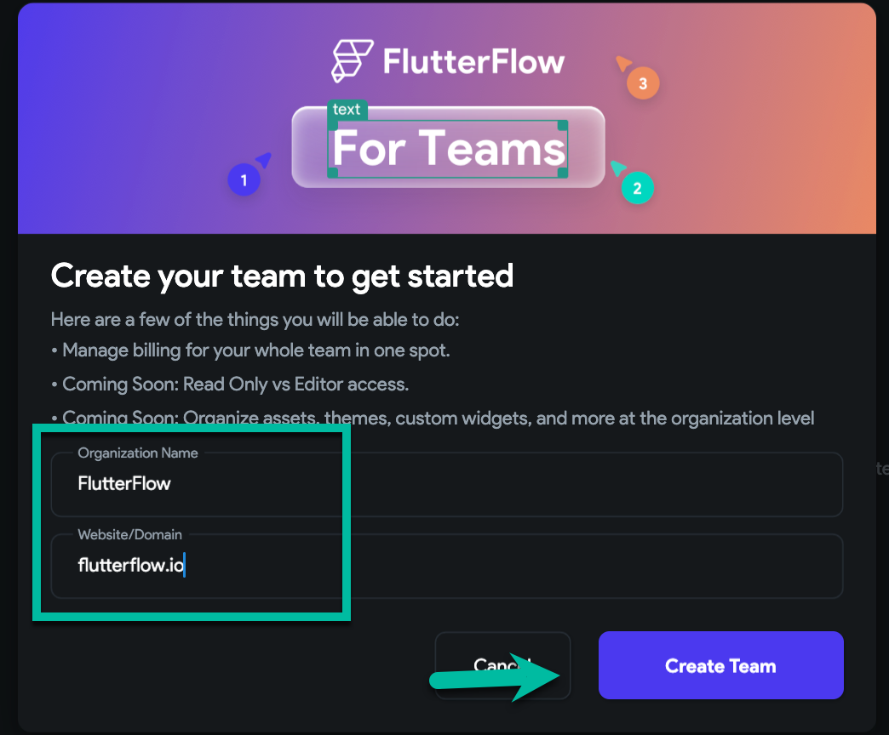
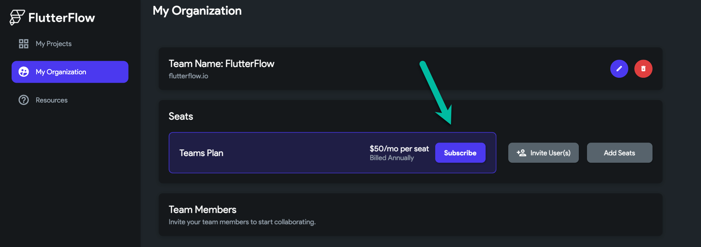
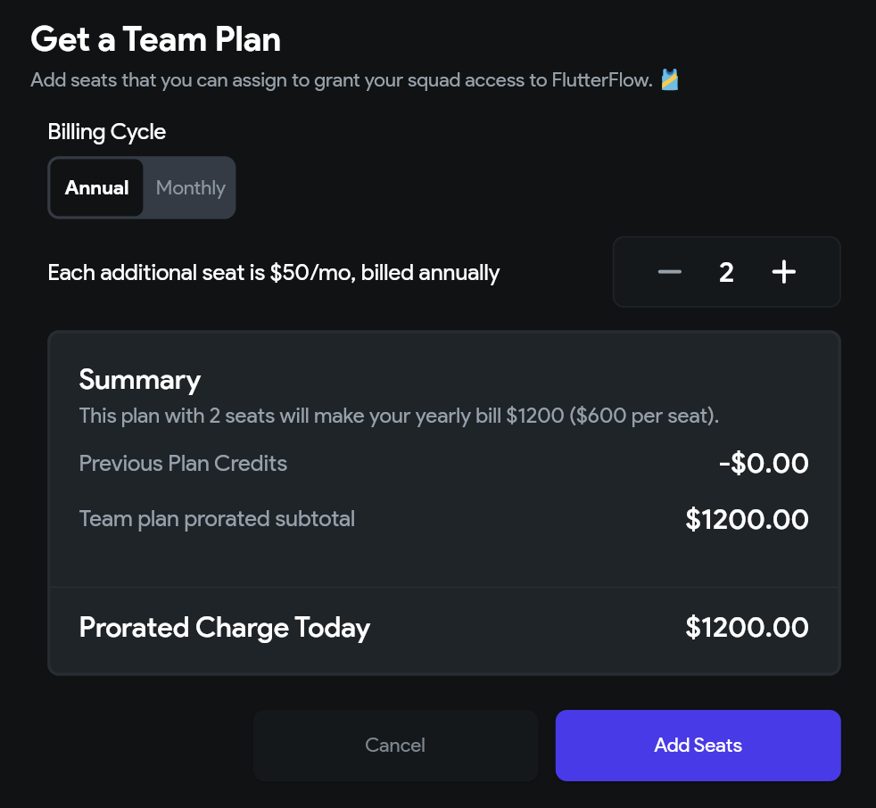
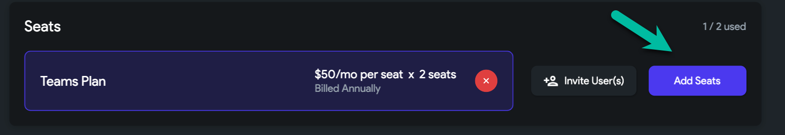
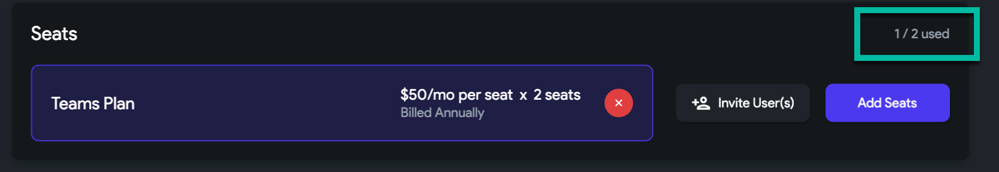
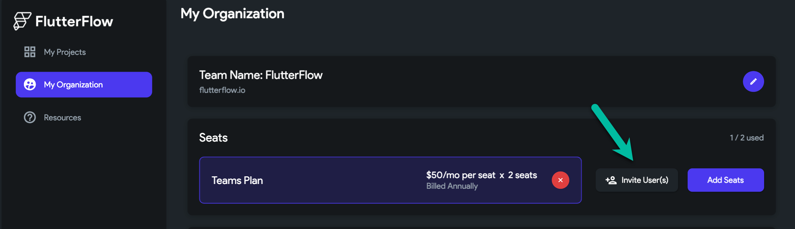
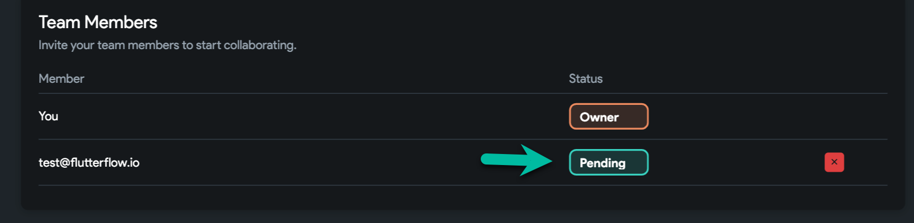
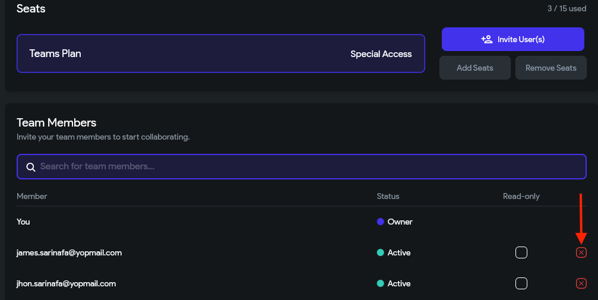
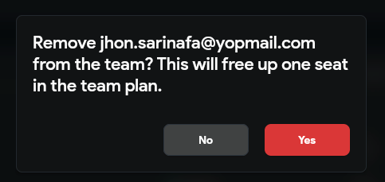

# Upgrading to a Teams plan

Our Teams plan is a great option for anyone looking to build collaboratively in real-time with their team. In addition, our Teams plans offer many benefits including audit logs and Git-Style visual branching. You can learn more about our Teams features here.

:::note
Teams plans are annual plans and can have up to 20 team members. For an account with more than 20 members or for companies with more than $10 million in annual revenue, please reach out to sales@flutterflow.io
:::

## Steps to create a Teams plan: 

The following steps are required to create a Teams plan.

- Create A Team

- Purchase Seats

- Invite Users To Your Team

### Create A Team

:::note
Teams Plans do not include a free trial. Upgrading to a Teams plan will end your existing Standard or Teams trial.
:::

## Steps to change your account to a Teams plan

To change your account to a Teams Plan, please follow these steps:

- After logging into your FlutterFlow account, head to your account Dashboard and select **My Organization** from the top right.

- Select **Create Team**

    

- Next, enter your organization name (e.g. My Company) and your website/email domain (e.g. mycompany.com) and select **Create Team**.

    

- **Purchase Seats**
A seat grants one user the ability to use FlutterFlow. You will need to purchase a seat for each team member that you would like to add to your Team. 

- From the **My Organization** tab, select **Subscribe**.

- A popup will appear, select the number of seats (subscriptions) and billing cycle (monthly or annual).

:::tip
Additional users can be added to your team at any time in the future. 
:::

A checkout page will appear for you to complete the purchase. This can take a few seconds to load.

:::tip 
You can see how many seats you have used here:

:::

- **Invite Users To Your Team**

:::tip
If you add an existing FlutterFlow user to your Teams plan, they will need to manually cancel their subscription using these instructions. Once this is completed, please reach out to support@flutterflow.io or chat to process the refund for any remaining time on your monthly plan. We're working on automating this process soon!
:::

To invite a new user, select the **Invite User(s)** button.

A popup will appear, type the email of the user you would like to add. If they are not an existing user of FlutterFlow, they will be sent an invitation to join.

## Delete users from Teams plan

To remove a user from the teams, click on the **red cancel button** and select **Yes** in the popup to confirm the removal.

## FAQs

Can I reduce my Teams plan to one seat?
No, you can't. The minimum requirement is two seats, which includes one for the owner's pro plan + an additional team seat.