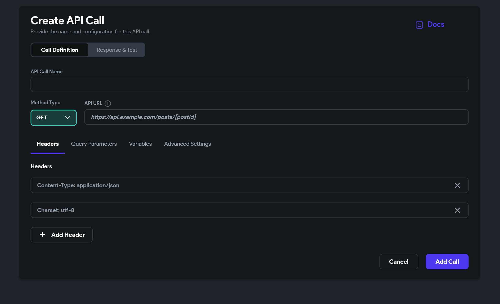
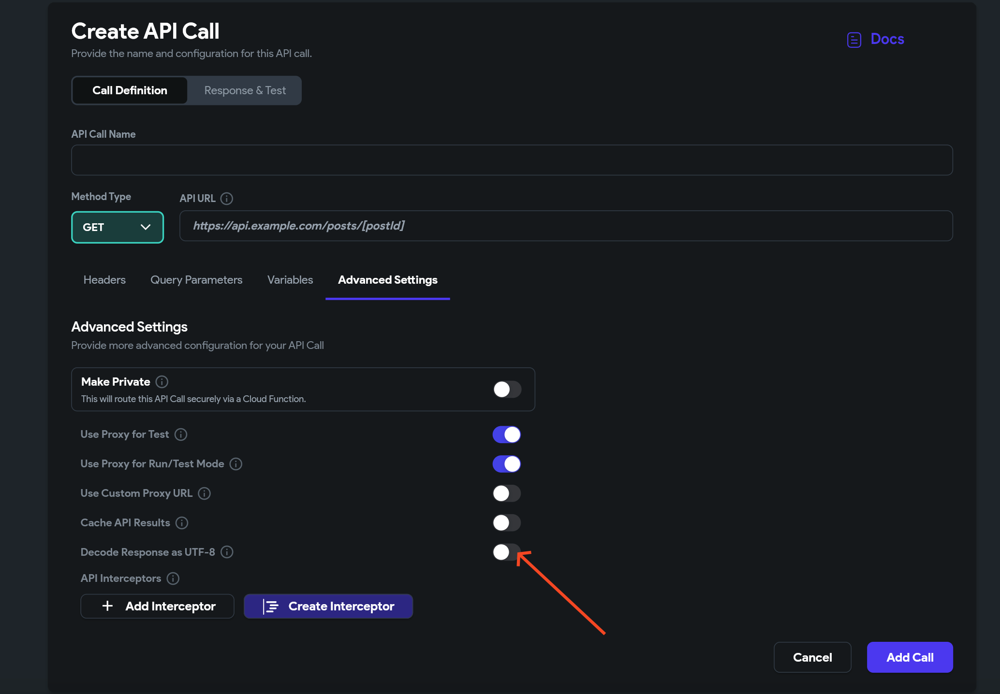

---
keywords:
  - api
  - encoding
  - charset
slug: /troubleshooting/api/api-charset-and-encoding-fix-guide
title: API Charset and Encoding Fix Guide
description: >-
  When working with API calls in FlutterFlow, you might encounter issues where
  the response returns with strange characters, incorrect formatting, or
  unreadable content.
tags:
  - FlutterFlow
  - Troubleshooting
  - API
last_verified: 2026-09-02
---
# API Charset and Encoding Fix Guide

When working with API calls in FlutterFlow, you might encounter issues where the response returns with strange characters, incorrect formatting, or unreadable content. These problems are often caused by improper charset or encoding settings either in the API request or the server response.

This guide shows you how to resolve such issues and ensure your API outputs are correctly displayed in your FlutterFlow project.

Follow the steps below:

1. **Set Proper Request Headers**

    Make sure your API call includes the appropriate headers to instruct the server on how to format the response. Add the following headers to your API configuration:

    - `Accept: application/json` when you expect JSON.
    - `Content-Type: application/json; charset=utf-8` only when the request actually sends a JSON body.

    `Content-Type` describes the request body; it does not force the server's response encoding. A standalone `Charset` request header is not the standard way to declare JSON encoding. The server should return an accurate response `Content-Type`, such as `application/json; charset=utf-8`.

    

2. **Enable UTF-8 Decoding in FlutterFlow**

    If the server omits or mislabels its response encoding but the response bytes are known to be UTF-8, you can configure FlutterFlow to decode the response as UTF-8 manually.

    To do this:

        1. Go to your API call setup in FlutterFlow.
        2. Scroll to **Advanced Settings**.
        3. Enable **Force response decoding as UTF-8**.

        This setting helps FlutterFlow correctly interpret the API response, especially from servers that don’t return standard headers.

        

:::tip[Final Tips]
- Always test your API calls in FlutterFlow’s API Test tab to ensure the response is properly formatted.
- Confirm that the external API supports UTF-8 and returns a valid JSON response.
- Review your server settings if you control the backend, to ensure it sends the correct headers.
- Do not force UTF-8 when the server actually returns a different encoding or compressed/binary data; correct the server or decode according to its documented format.
:::

:::note
Incorrect API call outputs due to charset or encoding can be quickly resolved by:
- Sending an appropriate `Accept` header and an accurate request `Content-Type` when the request has a body.
- Enabling **Force response decoding as UTF-8** in FlutterFlow’s API advanced settings.
These simple steps will help you get accurate and readable data from your APIs, resulting in a smoother app development experience.
:::

If you still face challenges, don't hesitate to reach out to our support team through Live chat or by emailing support@flutterflow.io

## Related documentation

See [Client-Server Errors during the API call](/troubleshooting/api/client-server-errors-during-the-api-call) for a related FlutterFlow workflow.
