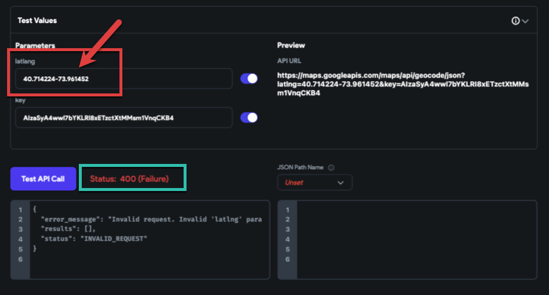
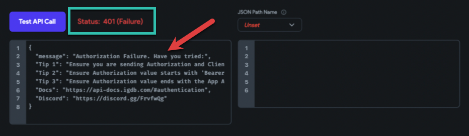
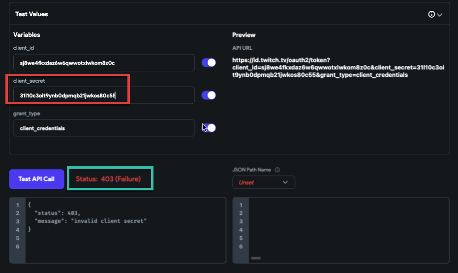
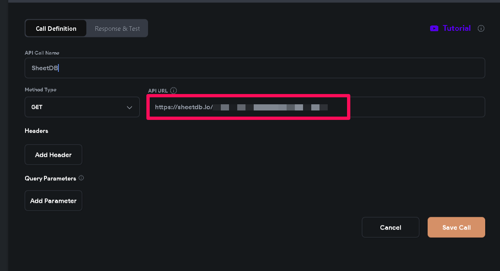
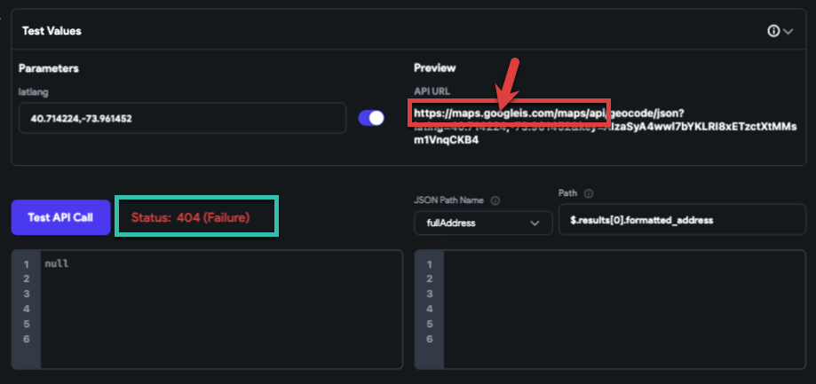

# Client-Server Errors During the API Call

When calling an API in FlutterFlow, you may run into client-server errors. These typically come as status codes that indicate what went wrong, either on your end (the client) or on the server you're requesting data from.

This guide will help you understand the most common API error codes and how to fix them.

To learn more about APIs, check out our **[API documentation guide](/resources/backend-logic/rest-api/)**.

## Common Client-Side Status Codes

These errors are usually caused by incorrect requests from the client side.

- **400 – Bad Request**

    The 400 error is a generic response indicating that the server could not understand the request due to malformed syntax. Common causes include incorrect query parameters or missing fields in the request body. Ensure your request is correctly formatted and all required information is included.

    :::tip
    Check the API's own documentation to ensure you're including the correct fields and headers.
    :::

    

- **401 – Unauthorized**

    This status code appears when authentication has not yet been provided. To resolve this, ensure you have signed up for the API and included your API key in the HTTP header of your request.

    

- **403 – Forbidden**
    
    Receiving a 403 error means you're authenticated but do not have permission to access the requested resource. This could be due to using the wrong API key or attempting to access features not available in your subscription plan.

    

- **404 – Not Found**

    The 404 error indicates that the requested URL does not exist on the server. This could be due to a typo in the URL or changes in the API endpoints. Always verify the URL and check for any recent API updates.

    **Common Reasons for 404 Errors:**

        1. **Incorrect Endpoint URL**  
        Double-check that the base URL and endpoint path are spelled correctly and match what’s defined in the API documentation.

        2. **Missing or Incorrect Parameters**  
        Some APIs require specific query or path parameters. Ensure that all required parameters are included and correctly formatted.

        3. **Trailing Slashes**  
        Some endpoints treat URLs with trailing slashes (e.g., `/users/`) differently than without (e.g., `/users`). Try removing or adding the trailing slash to see if it resolves the issue.

        4. **Authorization or Access Restrictions**  
        If the endpoint exists but is protected, ensure that the correct headers (e.g., `Authorization`) are added to the request.

        Example Error Message:

            

            The error message typically includes the requested URL and response code, which can help narrow down the issue.

            :::tip
            - Always compare the URL structure in your FlutterFlow API call to the official documentation of the API provider. Use tools like **[Postman](https://www.postman.com/)** to test endpoints independently before implementing them in FlutterFlow.
            - Always double-check your request URL before troubleshooting further.
            :::

            

- **407 – Proxy Authentication Required**

    You haven't authenticated with the proxy server. This is less common but can happen in restricted network environments.

- **422 – Unprocessable Entity**

    Your request was well-formed but couldn’t be processed. For example, passing a `latlng` without a comma.

- **429 – Too Many Requests**

    This error occurs when too many requests are sent in a short period, exceeding the API's rate limits. To avoid this, implement request throttling or review your API subscription plan to ensure it meets your needs.

    :::tip
    Check your API plan limits and consider throttling requests from your app.
    :::

## Common Server-Side Status Codes

These errors occur on the API server side.

- **500 – Internal Server Error**

    A 500 error can occur for various reasons, often indicating that the API server has crashed. Check your request for accuracy and consult the API documentation for any known issues.

- **501 – Not Implemented**

    This error occurs when the HTTP method used in the request is not supported by the server. Trying a different HTTP method or checking the API documentation for supported methods can resolve this issue.

- **502 – Bad Gateway**

    This error means that the server, acting as a gateway or proxy, received an invalid response from the upstream server. It's usually a temporary issue that should be resolved by the API provider.

- **503 – Service Unavailable**

    The 503 status code indicates that the server is temporarily unable to handle the request due to overload or maintenance. Waiting before sending another request is often the best approach.

- **504 – Gateway Timeout**

   A 504 error suggests that the server, acting as a gateway, did not receive a timely response from the upstream server. This could be due to network latency or the API server processing the request too slowly.

**Troubleshooting Steps**

- **Clear Browser Cache and Cookies**

    If you're encountering a 400 Bad Request error, clearing your browser's cache and cookies can resolve issues related to expired or invalid data.

- **Verify the Requested URL** 

    Ensure the URL or endpoint is correct. Remember, domain names are case-sensitive.

- **Adjust Request Parameters**

    For 400 errors, check if the file size is too large (for POST requests) or if there are any other incorrect parameters.

- **Consult API Documentation**

    Always refer to the API's official documentation for specific requirements and troubleshooting tips.

- **Contact API Support**

    If you continue to face issues, reaching out to the API's support team can provide further assistance and insights into resolving the problem.

Understanding these common API error status codes and their solutions can significantly smooth the development process, ensuring more efficient and effective communication between your application and the APIs you rely on.

:::tip[Final tips]
- Always check the API's own documentation, inspect your request, and look up error messages. If the issue persists, contact the API provider.
- Once you fix the issue, your calls should return a `200 OK`, which means everything is working as expected!
:::