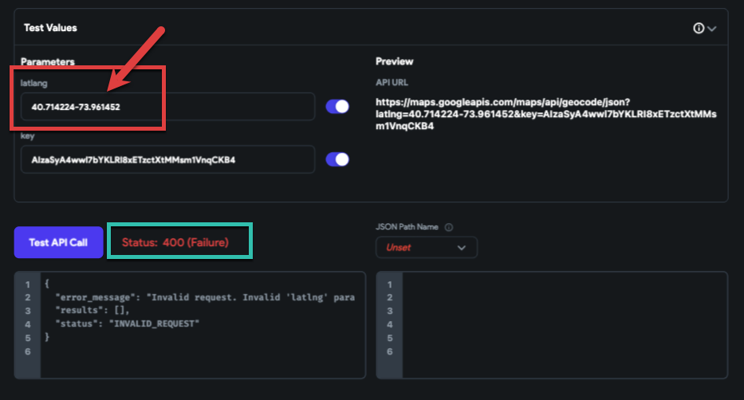
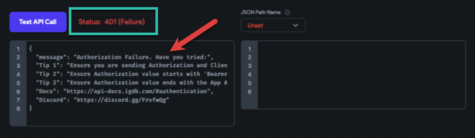
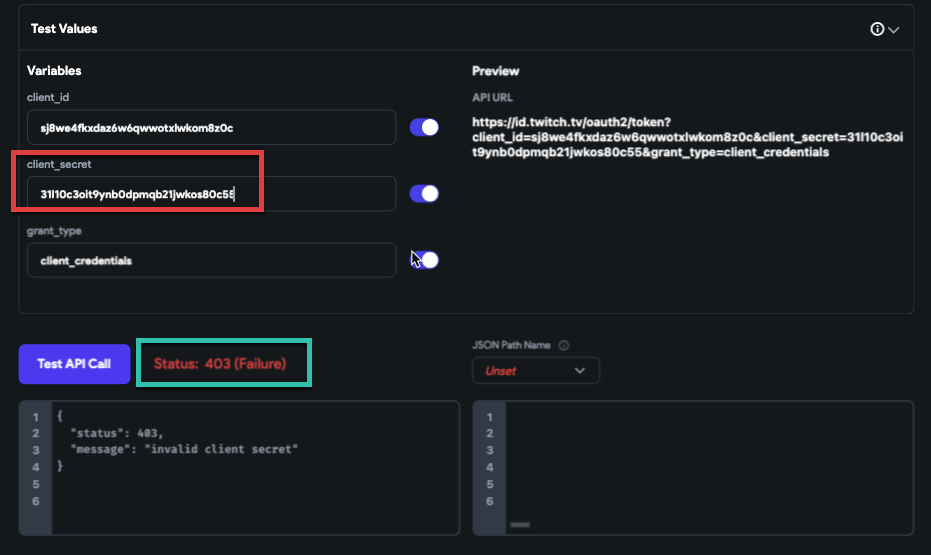
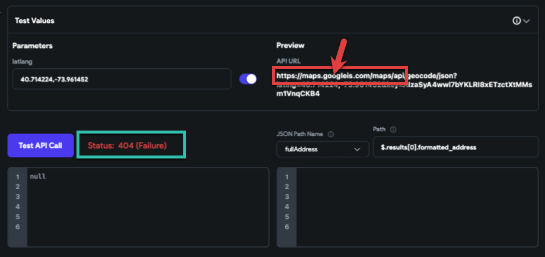

---
keywords:
  - api
  - error
  - client
slug: /troubleshooting/api/client-server-errors-during-the-api-call
title: Client-Server Errors during the API call
description: 'When calling an API in FlutterFlow, you may run into client-server errors.'
tags:
  - FlutterFlow
  - Troubleshooting
  - API
last_verified: 2026-09-02
---
# Client-Server Errors During the API Call

When calling an API in FlutterFlow, you may run into client-server errors. These typically come as status codes that indicate what went wrong, either on your end (the client) or on the server you're requesting data from.

This guide will help you understand the most common API error codes and how to fix them.

To learn more about APIs, check out our **[API documentation guide](/resources/backend-logic/rest-api/)**.

## Common Client-Side Status Codes

These errors are usually caused by incorrect requests from the client side.

- **400 – Bad Request**

    The 400 error is a generic response indicating that the server could not understand the request due to malformed syntax. Common causes include incorrect query parameters or missing fields in the request body. Ensure your request is correctly formatted and all required information is included.

    :::tip
    Check the API's own documentation to ensure you're including the correct fields and headers.
    :::

    

- **401 – Unauthorized**

    This status code means authentication is missing, invalid, or expired. Follow the API's documented authentication scheme; do not assume every API uses a client-visible API key.

    

- **403 – Forbidden**

    Receiving a 403 error means you're authenticated but do not have permission to access the requested resource. This could be due to using the wrong API key or attempting to access features not available in your subscription plan.

    

- **404 – Not Found**

    The 404 error indicates that the requested URL does not exist on the server. This could be due to a typo in the URL or changes in the API endpoints. Always verify the URL and check for any recent API updates.

    :::tip
    Always double-check your request URL before troubleshooting further.
    :::

    

- **407 – Proxy Authentication Required**

    You haven't authenticated with the proxy server. This is less common but can happen in restricted network environments.

- **422 – Unprocessable Entity**

    Your request was well-formed but couldn’t be processed. For example, passing a `latlng` without a comma.

- **429 – Too Many Requests**

    This error occurs when too many requests are sent in a short period, exceeding the API's rate limits. To avoid this, implement request throttling or review your API subscription plan to ensure it meets your needs.

    :::tip
    Check your API plan limits and consider throttling requests from your app.
    :::

## Common Server-Side Status Codes

These errors occur on the API server side.

- **500 – Internal Server Error**

    A 500 error can occur for various reasons, often indicating that the API server has crashed. Check your request for accuracy and consult the API documentation for any known issues.

- **501 – Not Implemented**

    This means the server does not implement the requested functionality. An unsupported HTTP method is normally `405 Method Not Allowed`; check the response body and API documentation before changing the request.

- **502 – Bad Gateway**

    This error means that the server, acting as a gateway or proxy, received an invalid response from the upstream server. It's usually a temporary issue that should be resolved by the API provider.

- **503 – Service Unavailable**

    The 503 status code indicates that the server is temporarily unable to handle the request due to overload or maintenance. Waiting before sending another request is often the best approach.

- **504 – Gateway Timeout**

   A 504 error suggests that the server, acting as a gateway, did not receive a timely response from the upstream server. This could be due to network latency or the API server processing the request too slowly.

**Troubleshooting Steps**

- **Inspect the exact request and response**

    In the FlutterFlow API test, browser developer tools, or backend logs, capture the status, response body, request method, URL, headers, and a redacted body. Never paste tokens, cookies, personal data, or secrets into tickets or public logs.

- **Verify the Requested URL**

    Ensure the URL or endpoint is correct. Domain names are case-insensitive, but URL paths and query parameter names can be case-sensitive.

- **Adjust Request Parameters**

    For 400 errors, check if the file size is too large (for POST requests) or if there are any other incorrect parameters.

- **Consult API Documentation**

    Always refer to the API's official documentation for specific requirements and troubleshooting tips.

- **Contact API Support**

    If you continue to face issues, reaching out to the API's support team can provide further assistance and insights into resolving the problem.

Understanding these common API error status codes and their solutions can significantly smooth the development process, ensuring more efficient and effective communication between your application and the APIs you rely on.

:::tip[Final tips]
- Always check the API's own documentation, inspect your request, and look up error messages. If the issue persists, contact the API provider.
- A successful API can return any documented `2xx` status, such as `200`, `201`, or `204`. Validate the response body and business result rather than checking only for `200`.
:::
