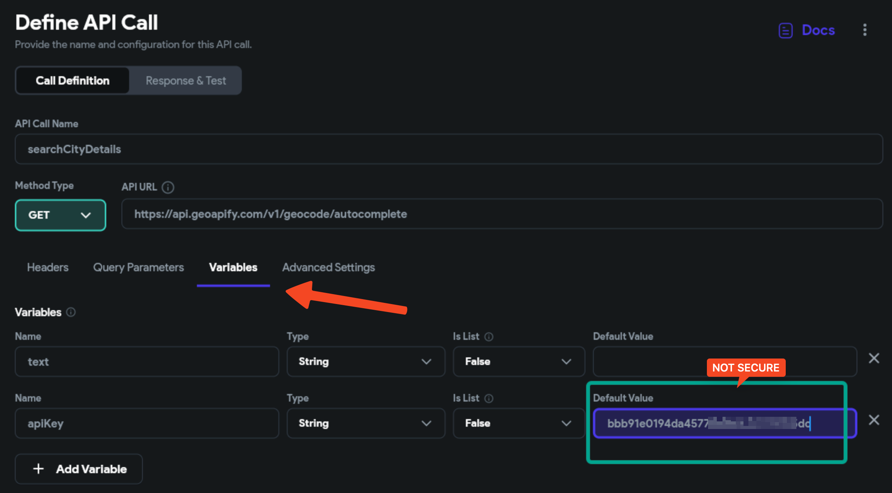
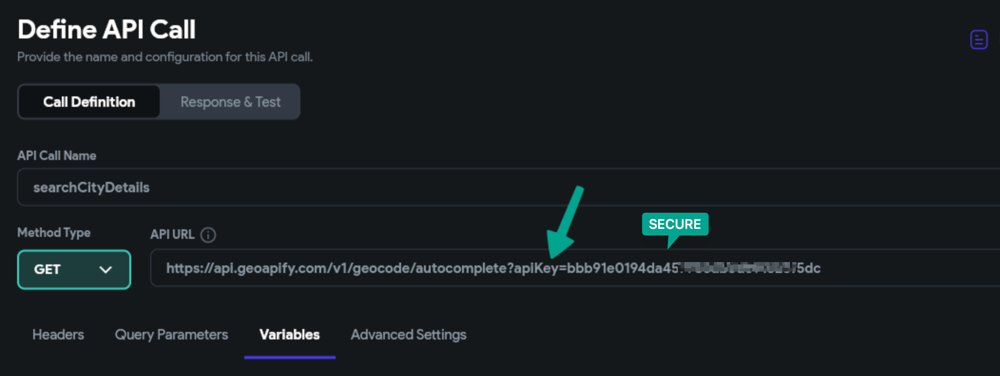

# Securing Your API Keys in Private API Calls


Ensuring the security of API keys is a critical aspect of building and maintaining a safe and reliable application. In the realm of private API calls, it's especially important to make sure your API keys are not exposed. This article aims to provide a best-practices guide on where to place your API keys to increase security in a FlutterFlow environment.​

**The Misconception: Private API Calls Secure Everything**

Many users assume that simply marking an API call as 'private' is enough to protect all associated data. However, this is not the case. Private API calls run in a Cloud Function, which means any keys or sensitive data in the body will be secure, as long as they're not passed in from the frontend. Even in private API calls, if you're loading an API key from the frontend (like from Firebase remote configs), then you're still exposing it.​

## Secure Placement of API Keys in Your Project

    The ideal way to secure an API key is to include it in a request header or directly within the API endpoint URL. This ensures that it is never passed in from the client, thereby maintaining its confidentiality.​

    For example, you can hard-code the key directly into your API call header like this:​

    ```js
    { "Authorization": "Bearer YOUR_API_KEY_HERE" }
    ```

    Or directly within the API endpoint URL:​

    ```js
    https://api.example.com/resource?api_key=YOUR_API_KEY_HERE
    ```
    The key should never be a variable that gets passed in from the frontend, as that would make it accessible via the client-side code, defeating the purpose of using private API calls for secure operations.

## Verifying the Security of Your API Key

    After implementing these changes, a straightforward way to verify that your key is secured is by downloading your application code and checking to make sure the API key doesn’t appear in any frontend files.​

    Example: Not Secure

    

    Example: More Secure

    


By adhering to these best practices, you can increase the safety of your API keys even while making private API calls. 

:::info
The goal is to keep all sensitive data, including API keys, away from the client side of the application to ensure optimal security.
:::
​