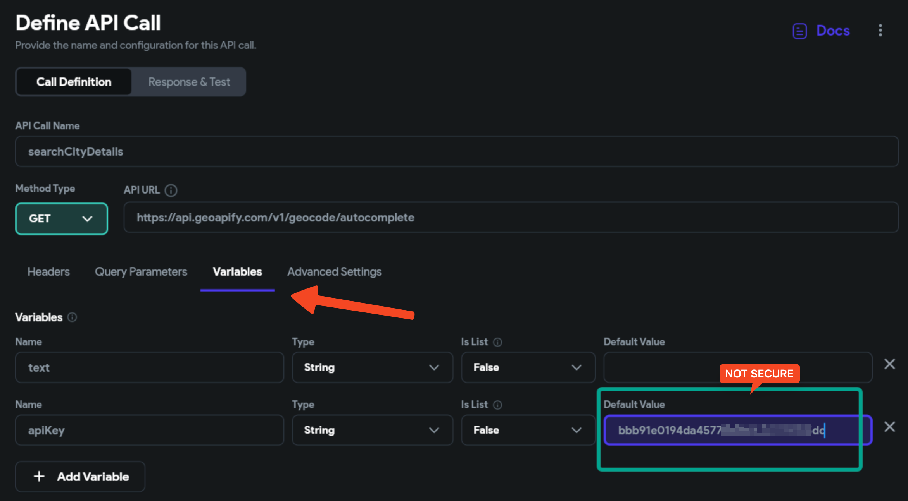
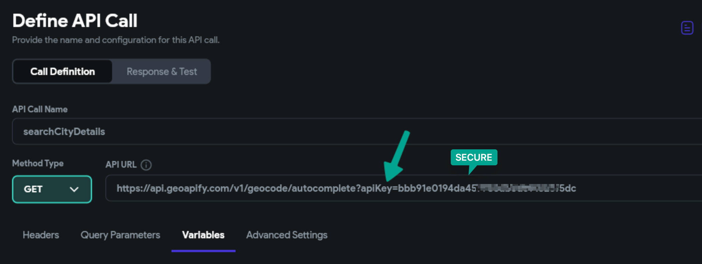

---
keywords:
  - api
  - calls
  - private
slug: /troubleshooting/api/securing-your-api-keys-in-private-api-calls
title: Securing Your API Keys in Private API Calls
description: >-
  Ensuring the security of API keys is a critical aspect of building and
  maintaining a safe and reliable application.
tags:
  - FlutterFlow
  - Troubleshooting
  - API
last_verified: 2026-09-02
---
# Securing Your API Keys in Private API Calls


Ensuring the security of API keys is a critical aspect of building and maintaining a safe and reliable application. In the realm of private API calls, it's especially important to make sure your API keys are not exposed. This article aims to provide a best-practices guide on where to place your API keys to increase security in a FlutterFlow environment.​

**The Misconception: Private API Calls Secure Everything**

Many users assume that simply marking an API call as private protects every value. A private call moves the provider request to a generated Cloud Function, but values supplied by the app are still known to the app and user. Remote Config is client-readable and is not secret storage. The backend must also authenticate the caller, authorize the requested operation, validate inputs, limit abuse, and avoid returning the provider credential in errors or responses.

## Secure Placement of API Keys in Your Project

    Put the credential in the private call's server-side header configuration or a supported private environment value. Prefer the deployment platform's secret manager when maintaining exported server code. Do not place secrets in URLs: URLs commonly appear in logs, analytics, browser history, proxies, and error reports.​

    For example, you can hard-code the key directly into your API call header like this:​

    ```js
    { "Authorization": "Bearer YOUR_API_KEY_HERE" }
    ```

    The key should never be a variable that gets passed in from the frontend, as that would make it accessible via the client-side code, defeating the purpose of using private API calls for secure operations.

## Verifying the Security of Your API Key

    Downloading the client and confirming the key is absent is one check, not proof of security. Also inspect generated server exports and Git history, network traffic, logs and error responses; verify caller authentication and authorization; restrict the provider key by API, environment, origin or IP where supported; set quotas and alerts; and rotate the key after exposure.​

    Example: Not Secure

    

    Example: More Secure

    


By adhering to these best practices, you can increase the safety of your API keys even while making private API calls.

:::info
The goal is to keep all sensitive data, including API keys, away from the client side of the application to ensure optimal security.
:::
​

## Related documentation

See [API Charset and Encoding Fix Guide](/troubleshooting/api/api-charset-and-encoding-fix-guide) for a related FlutterFlow workflow.
