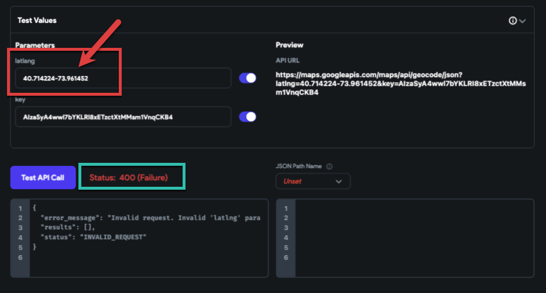
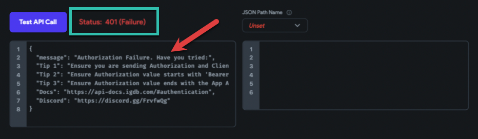
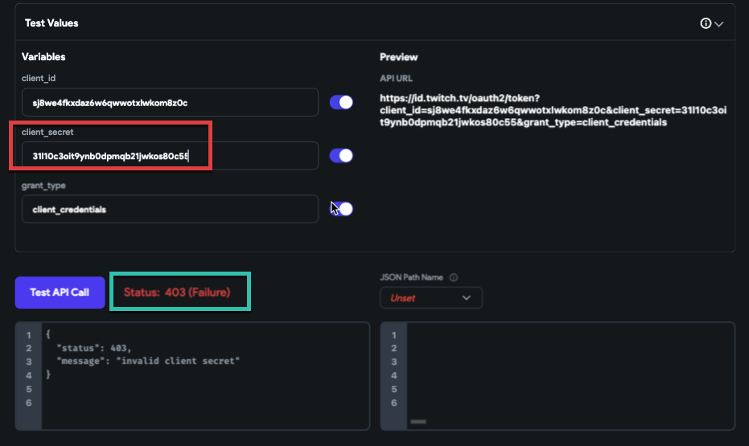
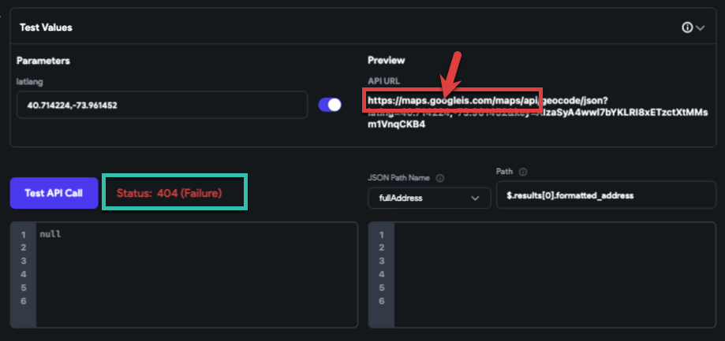

# Understanding and Troubleshooting API Error Status Codes

When integrating and utilizing Application Programming Interfaces (APIs), encountering error status codes is a common part of the development process. These errors can arise from a variety of issues, ranging from client-side mistakes to server-side problems. Understanding these errors and knowing how to troubleshoot them is crucial for developers. This article combines insights from two sources to provide a comprehensive overview of common API error status codes and troubleshooting steps.

## Client-Side Status Codes

- ### 400 Bad Request

    The 400 error is a generic response indicating that the server could not understand the request due to malformed syntax. Common causes include incorrect query parameters or missing fields in the request body. Ensure your request is correctly formatted and all required information is included.

    

- ### 401 Unauthorized:

    This status code appears when authentication has not yet been provided. To resolve this, ensure you have signed up for the API and included your API key in the HTTP header of your request.

    

- ### 403 Forbidden:

    Receiving a 403 error means you're authenticated but do not have permission to access the requested resource. This could be due to using the wrong API key or attempting to access features not available in your subscription plan.

    

- ### 404 Not Found:

    The 404 error indicates that the requested URL does not exist on the server. This could be due to a typo in the URL or changes in the API endpoints. Always verify the URL and check for any recent API updates.

    

- ### 429 Too Many Requests:

    This error occurs when too many requests are sent in a short period, exceeding the API's rate limits. To avoid this, implement request throttling or review your API subscription plan to ensure it meets your needs.

## Server-Side Status Codes

- ### 500 Internal Server Error:

    A 500 error can occur for various reasons, often indicating that the API server has crashed. Check your request for accuracy and consult the API documentation for any known issues.

- ### 501 Not Implemented:

    This error occurs when the HTTP method used in the request is not supported by the server. Trying a different HTTP method or checking the API documentation for supported methods can resolve this issue.

- ### 502 Bad Gateway:

    This error means that the server, acting as a gateway or proxy, received an invalid response from the upstream server. It's usually a temporary issue that should be resolved by the API provider.

- ### 503 Service Unavailable:

    The 503 status code indicates that the server is temporarily unable to handle the request due to overload or maintenance. Waiting before sending another request is often the best approach.

- ### 504 Gateway Timeout

    A 504 error suggests that the server, acting as a gateway, did not receive a timely response from the upstream server. This could be due to network latency or the API server processing the request too slowly.

## Troubleshooting Steps

### 1. Clear Browser Cache and Cookies:

If you're encountering a 400 Bad Request error, clearing your browser's cache and cookies can resolve issues related to expired or invalid data.

### 2. Verify the Requested URL: 

Ensure the URL or endpoint is correct. Remember, domain names are case-sensitive.

### 3. Adjust Request Parameters:

For 400 errors, check if the file size is too large (for POST requests) or if there are any other incorrect parameters.

### 4. Consult API Documentation: 

Always refer to the API's official documentation for specific requirements and troubleshooting tips.

### 5. Contact API Support:

If you continue to face issues, reaching out to the API's support team can provide further assistance and insights into resolving the problem.

Understanding these common API error status codes and their solutions can significantly smooth the development process, ensuring more efficient and effective communication between your application and the APIs you rely on.

