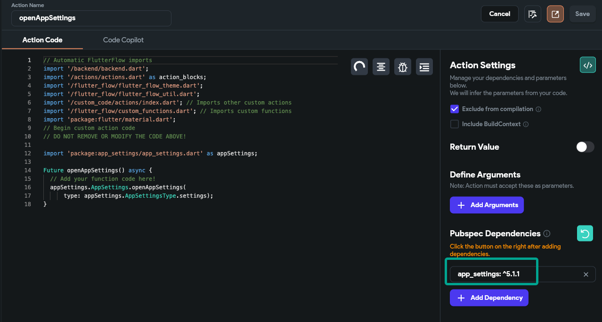

# Codemagic Install Pods Failure

During Codemagic deployment, errors may occur at the **Install Pods** step due to issues related to iOS dependency management. This article outlines common causes and solutions to resolve these errors.

## Custom Code Package Conflicts

Conflicts between custom code packages and existing project dependencies can prevent pods from installing correctly. Flutter dependencies have version constraints, and introducing new packages or updating versions without checking compatibility may cause version conflicts.

**Solution:**

  - Check package documentation for compatibility issues.
  - Update package versions in `pubspec.yaml` to versions known to be compatible.
  - Run `flutter pub get` to refresh dependencies.

    For example, the package `platform_device_id` may cause conflicts:

    

## Deployment from an Incompatible GitHub Branch

Deploying from a GitHub branch that contains untested custom code or recent dependency changes may result in deployment failures.

  **Solution:**

    - Use a stable, fully tested branch for deployment.
    - Merge the latest stable changes into the deployment branch.
    - Remove experimental or untested code that may affect deployment.

      For example, the branch `dungtienle/folhavpnV3` may contain unstable code:

      

    - Review recent commits to identify and address changes affecting pod installation.
    - Revert problematic commits if necessary.

## Incompatible Pod Versions

CocoaPods may fail to resolve compatible versions for specific pods, such as `app_settings`, especially if the pod version conflicts with other pods or the iOS deployment target.

  **Solution:**

    - Update the version of `app_settings` in `pubspec.yaml` to a compatible version.
    - If necessary, increase the iOS minimum deployment target using Xcode.

      For example, the engineering team identified `app_settings` as the cause:

      

    - Adjust the iOS deployment target following Apple's or Amplify’s iOS platform setup guidance.

  :::info[Deployment Best Practices]
  - Verify package compatibility before adding new dependencies or upgrading existing ones.
  - Always deploy from stable, tested branches.
  - Ensure the iOS deployment target version meets the requirements of all packages and pods.
  :::

  By following these steps, you can resolve the **Install Pods** error and successfully deploy your app with Codemagic in FlutterFlow.