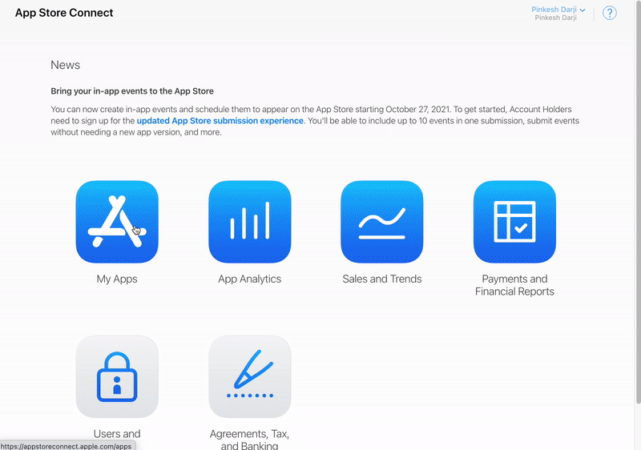

# iOS Deployment Authentication Error

During iOS deployment using Codemagic, you may encounter an authentication credentials error due to misconfigured or expired tokens while setting up App Store deployment.

**Invalid Authentication Credentials**

This error indicates that the API token used for App Store Connect is either expired or invalid.

For detailed information on generating valid tokens, refer to the **[Apple API Token Documentation](https://developer.apple.com/go/?id=api-generating-tokens)**.

**Full Error Message**

```
Failed Step: Fetch signing files
GET https://api.appstoreconnect.apple.com/v1/bundleIds?limit=100&sort=name&filter%5Bidentifier%5D=appname.com&filter%5Bplatform%5D=IOS returned 401: Authentication credentials are missing or invalid. Provide a properly configured and signed bearer token, and make sure that it has not expired. Learn more about Generating Tokens for API Requests https://developer.apple.com/go/?id=api-generating-tokens 
```

**Steps to Resolve the Issue**

Follow these steps to generate a new API Key and update it in FlutterFlow:

1. Navigate to **App Store Connect**, select **Users and Access**, then select **Keys**.

2. If visible, click **Request Access**.

3. Select **Generate API Key** or click the **Add (+)** button.

4. In the popup window, provide the required API Key information:
   - **Name**: Enter a reference name for the key.
   - **Access**: Select the appropriate access type.

5. Select **Generate** to create the API Key.

6. Locate the newly created API Key and select **Download API Key**.

   :::note
   If the **Download API Key** link does not appear immediately, refresh the page.
   :::

7. Return to **FlutterFlow**, navigate to **Settings & Integrations → Deployment**.

8. Under **Private Key**, select **Upload Private Key**, choose the downloaded API Key file, and select **Open**.

9. Attempt to redeploy your app after uploading the new key.




If the error persists after completing these steps, contact FlutterFlow support via in-app messenger or email at [support@flutterflow.io](mailto:support@flutterflow.io).