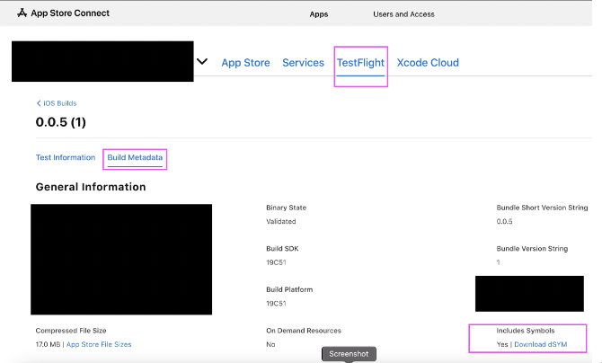
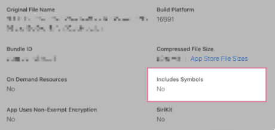

# Download dSYM File from App Store Connect

To download the dSYM file from the App Store Connect Developer Console, follow these steps:

    - **[Sign in](https://appstoreconnect.apple.com/)** to App Store Connect with your Apple Developer account.
    - Open your app.
    - Select a build from the **TestFlight** tab on your project page.
    - Open the **Build Metadata** tab.
    - Under **Include Symbols**, download your dSYM file.

    

:::note 
The dSYM file is only available for builds that have been successfully uploaded to App Store Connect and are in a "processing" or "ready for submission" state.
:::

    
If the **Download dSYM file** link is not visible, it indicates that the build submission did not complete successfully. In this case:

    - Redeploy the build to the App Store.
    - After successful processing, return to the Build Metadata tab and download the dSYM file.

        
