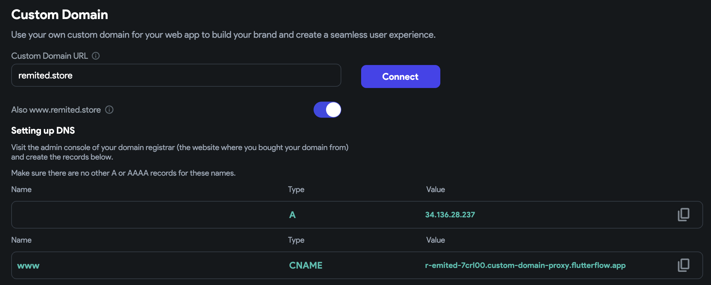

# Publishing Custom Domains in FlutterFlow

Having trouble connecting your custom domain in FlutterFlow? In this article, we've outlined some common issues users face and step-by-step solutions to get you back on track.

## Issue: 
Unable to Connect Custom Domain (Error: Expected DNS records not found)

Scenario:
You've set up the DNS records for your domain, but the connection still fails.

:::tip
Misconfigured DNS is often the culprit.
:::

## Background: 
FlutterFlow requires specific DNS records for custom domain connection, and you should set them according to your domain. Here's where you'll find them:

:::note 
If you uncheck **“Also www...”** you won’t need to create the second, **CNAME** record.​
:::

## Troubleshooting Steps:

### Verify DNS Records:
Use tools like nslookup.io to check your DNS records against the required configuration.
Ensure the required A and CNAME records exist. No other A, AAAA, or CNAME records should interfere. Here's an example:

### Wait Period: 
DNS changes may take up to 24 hours to generate. Please wait at least an hour after making changes before retrying.

### Retry: 
If records are correct, retry connecting after some time.​

### Reach out to support: 
If all the settings are correct and you are still facing the issue after 48 hours, please communicate with the domain registrar.

## Issue: 
Difficulty Creating DNS Records

:::tip
Each registrar may have a different interface, complicating the process.***
:::

## Suggestions:

- When you create a record for a root domain, e.g. example.com, some registrars require the “name” field for the record to be empty, some require “@”, and some - a full domain name (example.com).

- When they create a record for a subdomain, e.g. test.example.com, some registrars require the “name” field for the record to be the name of the subdomain (”test”), some - full name (test.example.com).

Please refer to Registrar-specific documentation to learn more about how you can set up the DNS records.

## Issue: 
Error 404 After Connecting Domain

## Solution:

Please try publishing the project after connecting the domain, it should resolve the issue that you are experiencing regarding Error 404.

## DNS Restrictions for SSL Certificates

### Background: 
The DNS might be restricting the SSL certificate authorities, which results in an error while connecting the domain.​

### Solution: 

- Verification:
Use nslookup.io to check for CAA records. you should be able to check that using this link: https://www.nslookup.io/domains/your-site-name/dns-records/caa/. consider replacing "your-site-name" with your site.

- Adjustment:
Add "letsencrypt.org" to allow authorities or remove CAA records.

- Outcome:
FlutterFlow should connect once DNS is adjusted.

By following these steps, you can troubleshoot and resolve common issues encountered when connecting a custom domain in FlutterFlow. If you still face challenges, don't hesitate to reach out to our support team through Live chat or by emailing support@flutterflow.io

