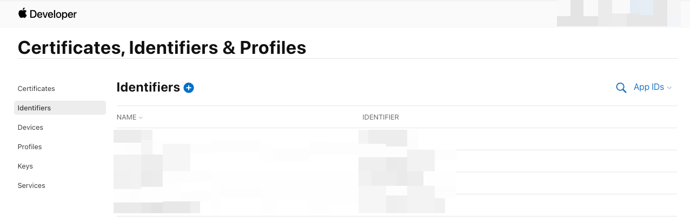

# Provisioning Profile Error Associated Domains

When deploying an iOS app to the App Store, the following error may occur:

    ```text
    Provisioning profile [App Store Project ID] doesn't support the Associated Domains capability
    ```

    This error is related to missing capabilities in your provisioning profile and must be fixed in the Apple Developer portal.

:::info[Prerequisites]
You need an active Apple Developer account with access to the **Certificates, Identifiers & Profiles** section.
:::

This error appears when the provisioning profile does not support the **Associated Domains** capability. This is required for:

    - Universal Links  
    - Dynamic Links  
    - App Clips  
    - Website authentication

Follow the steps below to resolve the error:

1. **Open Apple Developer Portal**

    Visit the **[Apple Developer Account](https://developer.apple.com/account/)** and go to:

        **Certificates, Identifiers & Profiles > Identifiers**

        


2. **Select App Identifier**

    Click the **App ID** that matches your FlutterFlow project.


3. **Enable Associated Domains**

    In the capabilities section:

        - Check the box for **Associated Domains**
        - You do not need to create a new App ID

            


4. **Save Changes**

    Click **Save** to update your App ID.


5. **Redeploy from FlutterFlow**

    Return to FlutterFlow and deploy the app again.


## Developer Account Limitations

    The **Associated Domains** capability is only available with a paid Apple Developer Program membership.


    - Check Subscription Status

        In the Apple Developer portal:

            - Look for **Subscription Status**
            - It should say **Active**
            - If not, an **Expiration Date** will be shown

                

        :::warning
        If you're using **Dynamic Links**, enabling this capability is required.
        :::


For additional support, contact Apple Developer Support at [devsupport@apple.com](mailto:devsupport@apple.com).
