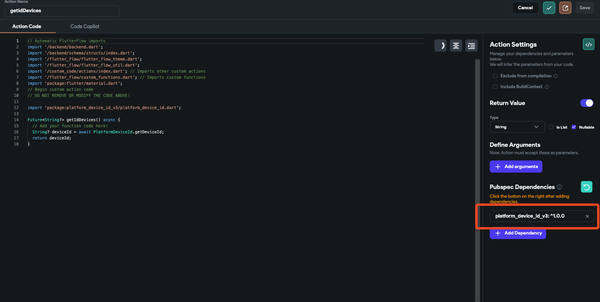
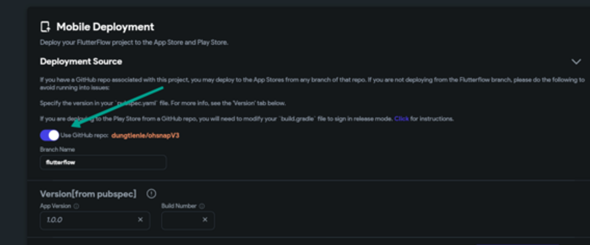
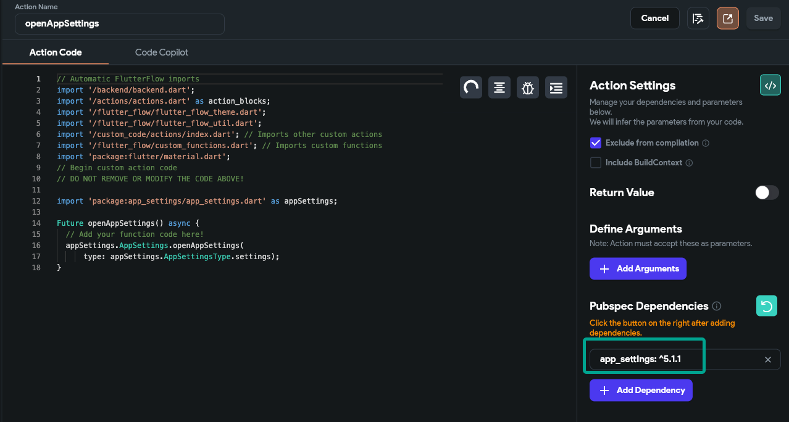

# Codemagic Install Pods Failure

During Codemagic deployment, errors may occur at the **Install Pods** step due to iOS dependency conflicts, unstable code branches, or pod version mismatches. This guide outlines steps to identify and resolve these issues effectively.

:::info[Prerequisites]
- You are deploying an iOS app using Codemagic.
- Your project includes custom code or third-party packages.
:::

## Fix Dependency Conflicts from Custom Code

Custom code or third-party packages may introduce conflicting versions of dependencies that prevent CocoaPods from resolving successfully.

**Steps to Resolve Install Pods Failure:**

- **Check for Dependency Conflicts from Custom Code**  
   Custom or third-party packages may cause version mismatches with FlutterFlow-supported dependencies.

   - Review documentation to ensure package compatibility.
   - Adjust versions in your `pubspec.yaml` file accordingly.
   - Run:

     ```bash
     flutter pub get
     ```

      

- **Use a Stable GitHub Branch for Deployment**  
   Deploying from unstable branches can introduce unexpected errors during pod installation.

   - Ensure you're using a branch that passed previous Codemagic deployments.
   - Remove untested or experimental code.
   - Revert or refactor recent commits that might break dependencies.

   

- **Fix Pod Version Compatibility Issues**  
   CocoaPods may fail to resolve dependencies due to incompatible versions or incorrect iOS deployment targets.

   - Update packages like `app_settings` in `pubspec.yaml` to versions compatible with your Flutter version.
   - Raise the iOS minimum deployment target in Xcode if necessary.

   

:::tip[Deployment Best Practices]
- Confirm dependency compatibility before pushing changes.
- Always deploy from tested GitHub branches.
- Verify your deployment target supports all pods used.
:::