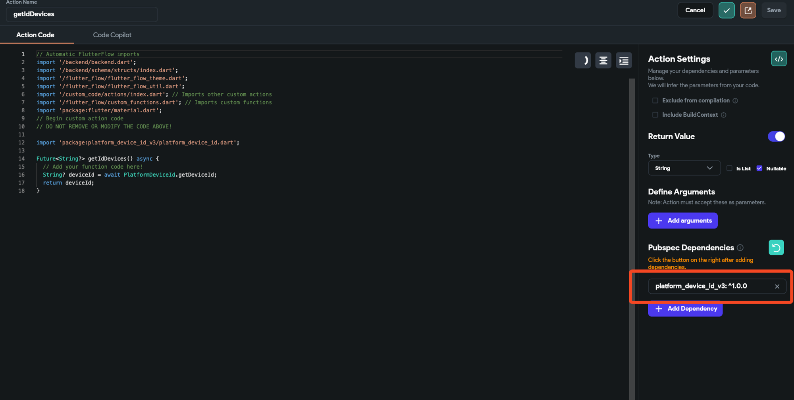
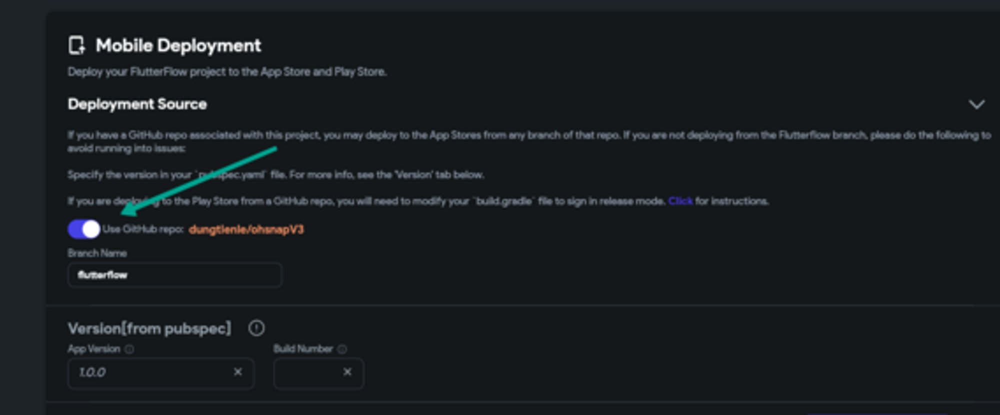
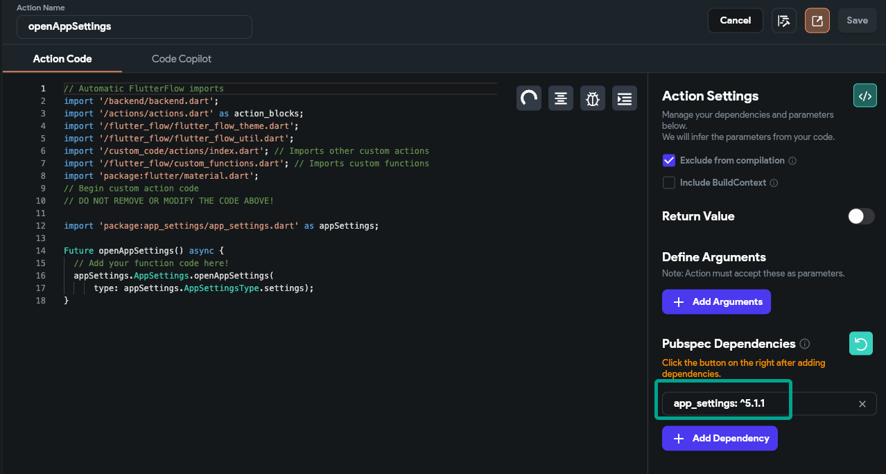

---
keywords:
  - deployment
  - flutter
  - exited
slug: /troubleshooting/apple-store-deployment/codemagic-install-pods-failure
title: Codemagic Install Pods Failure
description: >-
  During Codemagic deployment, errors may occur at the Install Pods step due to
  iOS dependency conflicts, unstable code branches, or pod version mismatches.
tags:
  - FlutterFlow
  - Troubleshooting
  - Apple Store Deployment
last_verified: 2026-09-02
---
# Codemagic Install Pods Failure

During Codemagic deployment, errors may occur at the **Install Pods** step due to iOS dependency conflicts, unstable code branches, or pod version mismatches. This guide outlines steps to identify and resolve these issues effectively.

:::info[Prerequisites]
- You are deploying an iOS app using Codemagic.
- Your project includes custom code or third-party packages.
:::

## Fix Dependency Conflicts from Custom Code

Custom code or third-party packages may introduce conflicting versions of dependencies that prevent CocoaPods from resolving successfully.

**Steps to Resolve Install Pods Failure:**

- **Check for Dependency Conflicts from Custom Code**
   Custom or third-party packages may cause version mismatches with FlutterFlow-supported dependencies.

   - Review documentation to ensure package compatibility.
   - Adjust dependency constraints deliberately and keep them compatible with the Flutter/Dart version used by the build. Do not edit generated constraints blindly; compare with a fresh FlutterFlow export and preserve intentional overrides.
   - Run:

     ```bash
     flutter pub get
     ```

      

- **Use a Stable GitHub Branch for Deployment**
   Deploying from unstable branches can introduce unexpected errors during pod installation.

   - Ensure you're using a branch that passed previous Codemagic deployments.
   - Remove untested or experimental code.
   - Revert or refactor recent commits that might break dependencies.

   

- **Fix Pod Version Compatibility Issues**
   CocoaPods may fail to resolve dependencies due to incompatible versions or incorrect iOS deployment targets.

   - Update packages like `app_settings` in `pubspec.yaml` to versions compatible with your Flutter version.
   - Raise the iOS minimum deployment target only after checking your supported-device policy and all native targets/extensions. A higher target drops older iOS versions and must remain consistent in generated project and Pod configuration.

After each change, reproduce with the same Flutter and CocoaPods environment as deployment and inspect the first dependency-resolution error, not only the final `pod install` failure.

   

:::tip[Deployment Best Practices]
- Confirm dependency compatibility before pushing changes.
- Always deploy from tested GitHub branches.
- Verify your deployment target supports all pods used.
:::

## Related documentation

See [Codemagic Signing Certificate Limit](/troubleshooting/apple-store-deployment/codemagic-signing-certificate-limit) for a related FlutterFlow workflow.
