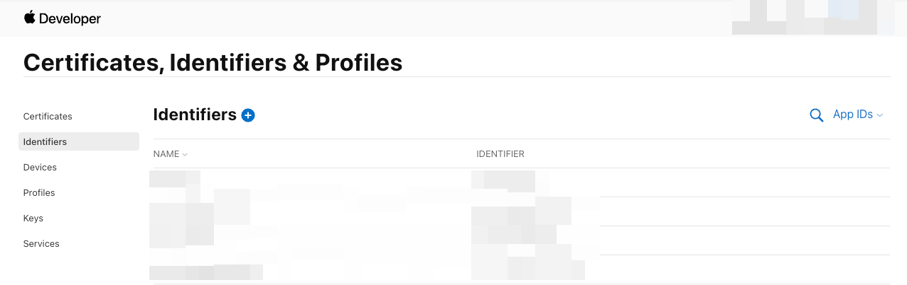
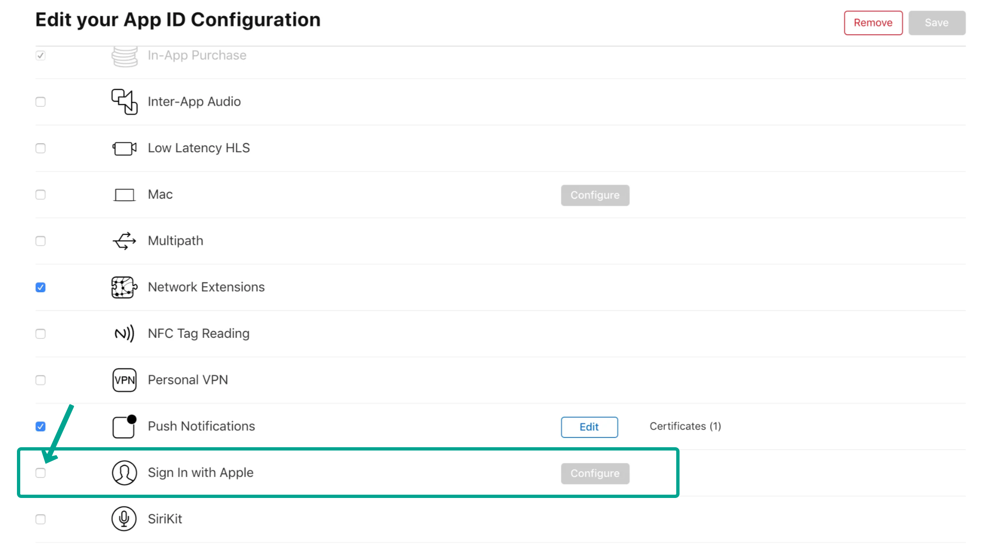

# Sign in with Apple Provisioning Profile Error

When deploying to the App Store, you may encounter an error stating that the provisioning profile does not support the **Sign in with Apple** capability. This error occurs when the feature is used in the app but not enabled for the associated App ID in your Apple Developer account.

:::info[Prerequisites]
You must have a registered App ID in your Apple Developer account with a provisioning profile configured for App Store distribution.
:::

Follow the steps below to resolve the error:

1. **Open the Apple Developer Portal**

    - Go to **[Apple Developer](https://developer.apple.com)**  
    - Navigate to **Certificates, Identifiers & Profiles**  
    - Open the **Identifiers** tab

        

2. **Select Your App Identifier**

    - Find the **App ID** associated with your project  
    - Click on it to open its configuration page

3. **Enable the Capability**

    - Under **Capabilities**, check the box for **Sign in with Apple**  
    - No new App ID or keys are required for this update

        

4. **Save Your Changes**

    - Click **Save** to apply the updated capability to your App ID  
    - Ensure no additional changes are needed before proceeding

5. **Redeploy the App**

    - In FlutterFlow, go to **App Settings > Mobile Deployment > App Store**  
    - Confirm the capability is enabled, then start your deployment