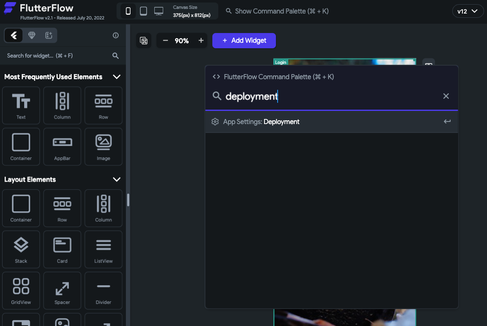
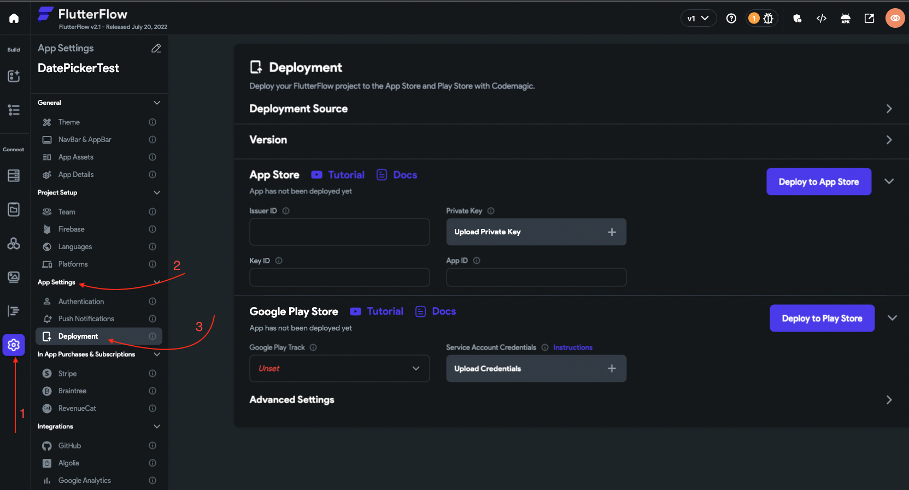
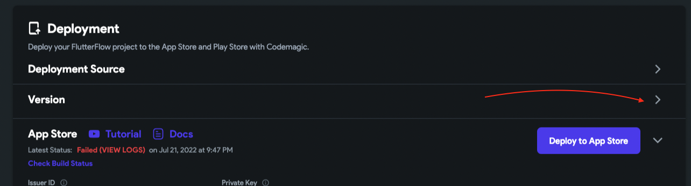
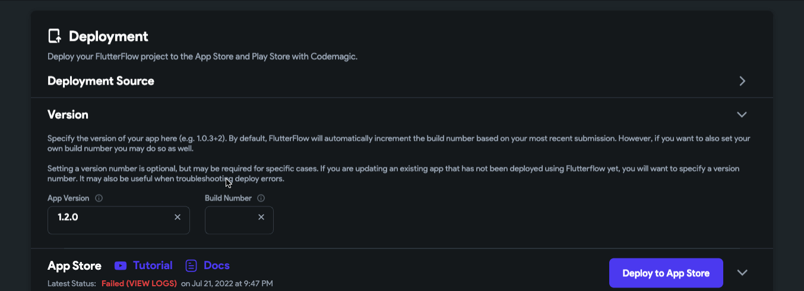

# Update Version to Fix Pre-Release Train Error

When submitting your app to the App Store, you may encounter the following error:

  ```text
  Invalid Pre-Release Train. The train version 'X.X.X' is closed for new build submissions.
  ```

This occurs when the app version you're trying to submit is already closed for new builds. Even if the build number has changed, the App Store will reject submissions for the same version number.

:::info[Prerequisites]
You must have access to your FlutterFlow project’s deployment settings and an active Apple Developer account to complete the steps below.
:::

Follow the steps below to resolve the issue:

1. **Open Deployment Settings**

  - Press `Cmd/Ctrl + K`, type **"deployment"**, and hit Enter.  
    This will open the **Deployment** page.

    

  - Alternatively, go to **Project Settings > Deployment**.

    

2. **Update Version Number**

  - Click the **Expand** icon next to the **Version** field.

    

  - Update the version to the next increment (e.g., from `1.2.0` to `1.2.1`).

    

3. **Redeploy Your App**

  After incrementing the version number, reattempt the deployment. The new version will be accepted.

## Versioning Guidelines

  Use **Semantic Versioning** to manage your app versions effectively:

    - **Major Version** (`1.x.x`): Introduces breaking changes.
    - **Minor Version** (`x.1.x`): Adds features without breaking existing functionality.
    - **Patch/Build Version** (`x.x.1`): Fixes bugs or applies minor changes.

    Choose a versioning strategy that best suits your development workflow.