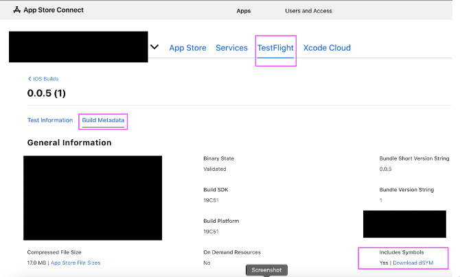
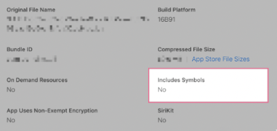

---
keywords:
  - connect
  - download
  - store
slug: >-
  /troubleshooting/apple-store-deployment/download-dsym-file-from-app-store-connect
title: Download dSYM File from App Store Connect
description: >-
  To download the dSYM file from the App Store Connect Developer Console, follow
  these steps.
tags:
  - FlutterFlow
  - Troubleshooting
  - Apple Store Deployment
last_verified: 2026-09-02
---
# Download dSYM File from App Store Connect

To download the dSYM file from the App Store Connect Developer Console, follow these steps.

:::info[Prerequisites]
- Access to your Apple Developer account.
- Your app has at least one build uploaded to App Store Connect.
:::

**Steps to Download the dSYM File:**

1. **Sign in** to **[App Store Connect](https://appstoreconnect.apple.com/)** with your Apple Developer account.
2. Open your app.
3. Select a build from the **TestFlight** tab on your project page.
4. Open the **Build Metadata** tab.
5. Under **Include Symbols**, download the dSYM file.

    

    :::note
    Symbol availability depends on how the build was produced and processed. Preserve the dSYM from the original archive or CI artifact whenever possible; App Store Connect is not a universal backup for locally generated symbols.
    :::

    If the **Download dSYM file** link is not visible, first confirm the selected build finished processing and whether App Store Connect generated downloadable symbols for it. A missing link does not always mean the upload failed. In this case:

        1. Check the original FlutterFlow/Codemagic build artifacts for the matching UUID.
        2. Verify UUIDs with the crash report or crash service before uploading symbols.
        3. Redeploy only when the original build itself failed or a corrected new build is required; a new build's dSYM does not symbolicate crashes from an older binary.

            

## Related documentation

See [ImageNotification Development Team Error](/troubleshooting/apple-store-deployment/imagenotification-development-team-error) for a related FlutterFlow workflow.
