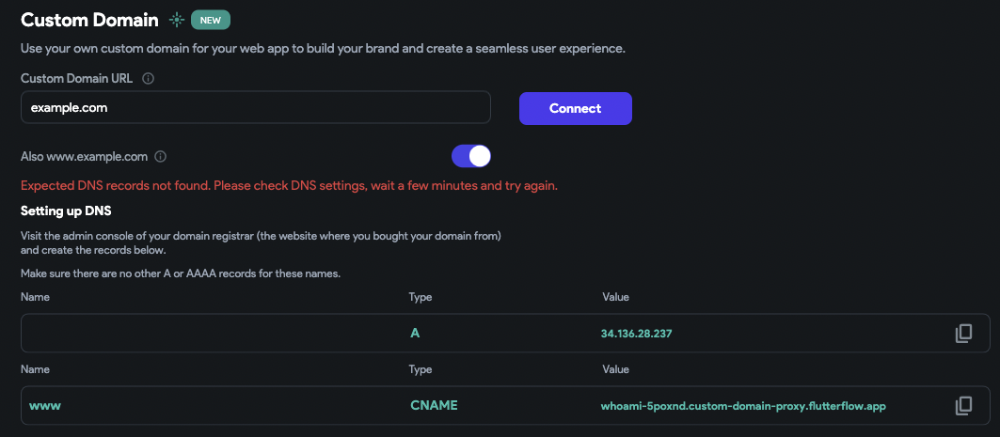
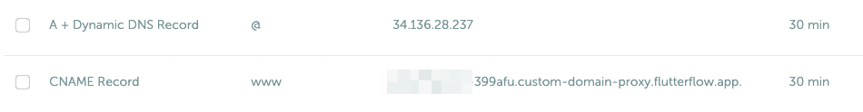
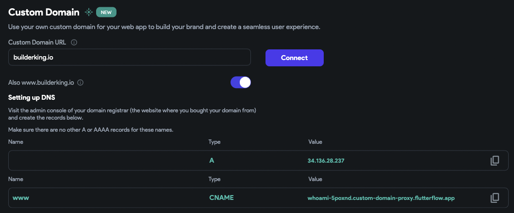
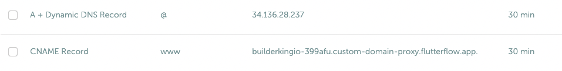

---
keywords:
  - configuration
  - connect
  - domain
slug: /troubleshooting/apple-store-deployment-issues/custom-domain-connection-error
title: Custom Domain Connection Error
description: >-
  If you encounter the error shown below after clicking Connect , follow these
  steps to resolve it: - Access to your domain registrar or DNS provider
  dashboard.
tags:
  - FlutterFlow
  - Troubleshooting
  - Apple Store Deployment Issues
last_verified: 2026-09-02
---
# Custom Domain Connection Error

If you encounter the error shown below after clicking **Connect**, follow these steps to resolve it:

:::info[Prerequisites]
- Access to your domain registrar or DNS provider dashboard.
- DNS management permissions to add or modify DNS records.
:::

**Steps to Resolve the Error:**

1. **Verify DNS Records**

    - Ensure that you have correctly configured the DNS records required for your custom domain connection.
    - Add the keys provided by FlutterFlow to your domain’s DNS settings.

        :::note
        For A records, if your DNS provider requires a name, you can use `"@"`. When you see an empty value, it typically refers to `"@"`.
        :::

        

2. **Check for Conflicting Records**

    - Review your DNS configuration to ensure there are no extra or unnecessary records that conflict with the FlutterFlow-provided keys.
    - For example, an existing A or AAAA record for the same root host can conflict with the values FlutterFlow displays. Remove or replace a record only after confirming its current service and saving a rollback copy. Do not delete MX, TXT, CAA, or unrelated subdomain records.

        :::note
        Before removing any existing DNS records, take screenshots and save them for reference.
        :::

        Below are examples of correct configurations in FlutterFlow and your DNS provider:

        

        

        By following these steps, you can ensure your custom domain is connected correctly.

## Related documentation

See [Custom Domain Connection Issues](/troubleshooting/apple-store-deployment-issues/custom-domain-connection-issues) for a related FlutterFlow workflow.
