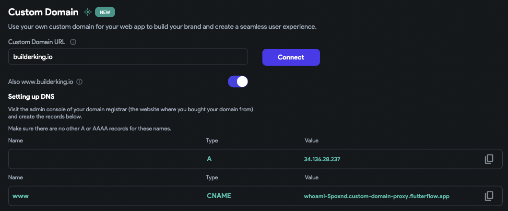
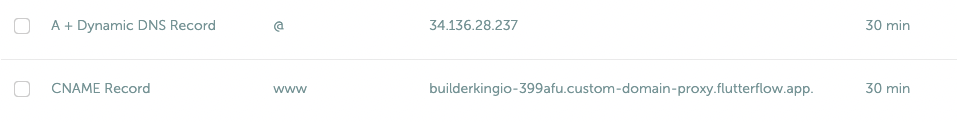

# Fix Custom Domain Connection Errors

This article outlines common causes and solutions for custom domain connection errors in FlutterFlow. These errors typically occur due to DNS misconfiguration or propagation delays when setting up a custom domain for your published web app.

:::info[Prerequisites]
- Access to your domain registrar or DNS provider dashboard.
- DNS management permissions to add or modify DNS records.
- Familiarity with basic DNS record types (A, CNAME, CAA).
:::

## Common Connection Error

If you see the error message below after clicking **Connect**, follow the steps in this article to resolve it.

## Steps to Resolve Domain Connection Issues

1. **Verify DNS Records**

    - Ensure that all required **A** and **CNAME** records have been added to your domain’s DNS settings as provided by FlutterFlow.
    - You can use **[nslookup.io](https://www.nslookup.io)** to confirm that your records match the expected values.

    :::note
    If your DNS provider requires a name for the record and none is shown in FlutterFlow, use `"@"`, which refers to the root domain (e.g., `example.com`).
    :::

    

2. **Check for Conflicting Records**

    - Remove any existing **A**, **AAAA**, or **CNAME** records that conflict with those provided by FlutterFlow.
    - For example, if you already have an **A** record using `"@"`, it must be deleted before adding FlutterFlow’s record.

    :::note
    Before deleting any existing DNS records, take screenshots for reference.
    :::

    Examples of correct configurations:

    

    

3. **Allow Time for DNS Propagation**

    - DNS changes typically take effect within minutes but may take up to **24 hours**.
    - Wait at least **1 hour** after making DNS changes before attempting to reconnect your domain.

4. **Retry Domain Connection**

    - After verifying the DNS records and allowing sufficient time for propagation, try reconnecting the domain in FlutterFlow.

5. **Handle Registrar-Specific DNS Formats**

    Different domain registrars may require specific formats for DNS record names. If you're unable to create records:

        - For **root domains** (`example.com`), use `"@"`, an empty name, or the full domain based on registrar requirements.
        - For **subdomains** (`test.example.com`), use just `"test"` or the full subdomain as needed.

        Consult your domain registrar’s documentation for the correct format.

6. **Fix 404 Errors After Successful Connection**

    If your domain is connected but you see a **404 error**, follow these steps:

    - **Publish the project again** from FlutterFlow.
    - Wait a few minutes, then reload your domain in the browser.

7. **Check CAA Records for SSL Certificate Issues**

    If the domain connection fails due to SSL certificate generation:

        1. Use [nslookup.io](https://www.nslookup.io/domains/your-site-name/dns-records/caa/) (replace `your-site-name` with your actual domain) to check for **CAA** records.
        2. If CAA records exist, make sure they allow `letsencrypt.org`.

        :::note
        Add `letsencrypt.org` as an allowed certificate authority to enable FlutterFlow to issue SSL certificates for your custom domain.
        :::

8. **Contact Support if Issues Persist**

    If the domain connection fails after verifying DNS records, allowing propagation, and retrying the connection:

    - Contact your **domain registrar** to verify DNS settings.
    - If the issue persists after 48 hours, reach out to the **FlutterFlow Support Team** at [support@flutterflow.io](mailto:support@flutterflow.io).
