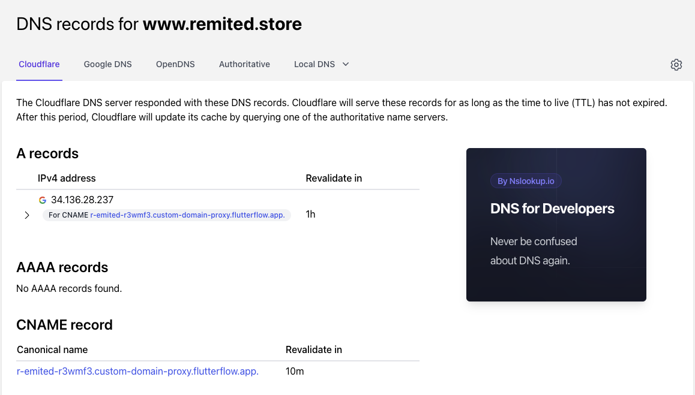

# Custom Domain Connection Issues

This article provides solutions for common problems encountered when connecting custom domains.

:::info[Prerequisites]
- Access to your domain registrar or DNS provider dashboard.
- DNS management permissions to add or modify DNS records.
- Familiarity with DNS record types (A, CNAME, CAA).
:::

**Steps to Resolve DNS Record Errors:**

1. **Verify DNS Records**

   - Use tools like **[nslookup.io](https://www.nslookup.io)** to verify that your DNS A and CNAME records match the configuration provided in FlutterFlow.
   - Ensure no conflicting A, AAAA, or CNAME records exist.

   

2. **Allow Time for DNS Propagation**

   - DNS updates may take up to 24 hours.
   - Wait at least one hour after making changes before attempting to reconnect your domain.

3. **Retry Connection**

   - After verifying DNS settings and allowing propagation, attempt to reconnect your domain.

4. **Contact Registrar Support If Necessary**

   - If settings are correct and the issue persists after 48 hours, contact your domain registrar to confirm DNS configuration.

**Handling Difficulty Creating DNS Records:**

- Different registrars require different formats for DNS record names:
  - For root domains (e.g., `example.com`), some require an empty name, others `"@"`, or the full domain name.
  - For subdomains (e.g., `test.example.com`), some require just `"test"`, others `"test.example.com"`.
- Consult your registrar’s documentation for exact instructions.

**Resolving 404 Errors After Domain Connection:**

   - Publish the project again after connecting the domain.
   - This usually resolves most 404 errors related to domain connections.

**Fixing DNS Restrictions for SSL Certificates:**

1. **Check for CAA Records**

   - Use **[nslookup.io](https://www.nslookup.io/domains/your-site-name/dns-records/caa/)** (replace `your-site-name` with your domain) to check CAA records.

2. **Adjust CAA Records**

   - Add `"letsencrypt.org"` to your allowed certificate authorities.
   - Remove any conflicting CAA records.

      :::note
      Once CAA records allow `"letsencrypt.org"`, FlutterFlow will be able to generate SSL certificates and complete the domain connection.
      :::

If issues persist after following these steps, contact FlutterFlow support via Live Chat or email at [support@flutterflow.io](mailto:support@flutterflow.io).
