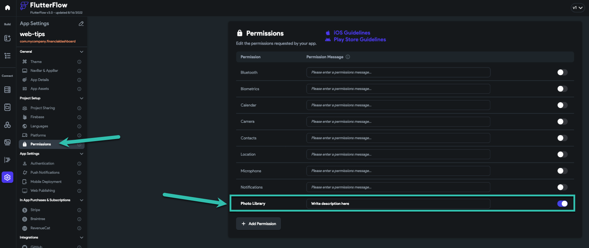
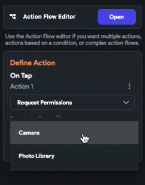

# Enable Photo Uploads in WebView on Real Devices

When uploading images inside a WebView, you may notice that it works correctly in Run/Test mode but fails on a real device. This typically happens due to missing permissions for accessing the device's photo library.

During **web runs**, permissions are handled by the browser, so uploading a photo does not require additional configuration. However, on **real devices**, access to the **photo library** is considered sensitive, and the operating system requires explicit permission.

Since the upload functionality is handled inside a **WebView**, FlutterFlow does not automatically detect the need to request photo library access — it only adds permissions based on native **Upload Image** actions.

:::info[Prerequisites]
This solution is for apps using WebView components to upload photos on iOS or Android devices.
:::

Follow these steps to add the required permissions and allow photo uploads via WebView on real devices:

1. **Enable Photo Library Permission**

   - Navigate to your project’s **Settings & Integrations**.
   - Click on the **Permissions** tab.
   - Enable the **Photo Library** permission.

      

2. **Request Permission at Runtime**

   - Before triggering the upload inside your WebView, ensure that the user has granted photo library access.
   - Use the **Get Permissions** action for the photo library.

      

3. **Reinstall the App**

   - Uninstall the app from your device.
   - Reinstall the app so the updated permission request can trigger correctly.
   - Run the app and accept the photo library access when prompted.

   :::warning
   If the app is not reinstalled, the new permissions may not be applied properly, and the upload functionality inside the WebView will continue to fail.
   :::

   FlutterFlow only adds required permissions when it detects specific native actions. Since WebView is treated as an embedded browser and does not directly signal an "Upload Image" intent, permissions like **Photo Library** must be manually enabled and managed.

:::info[Related Resources]
- [App Permissions Setup](/settings/permissions)
- [Using WebView in FlutterFlow](/components/webview)
:::
