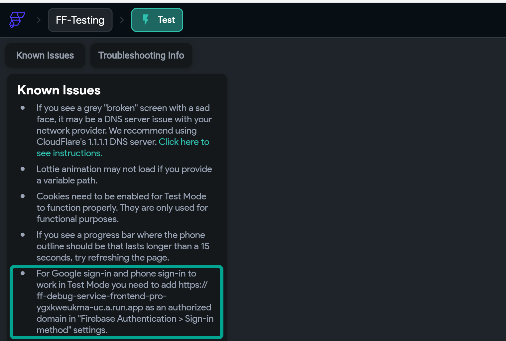

# Enable Google Sign-In for Run Mode and Published Web Apps

If you're using social login features like **Google Sign-In**, **Facebook**, or **Microsoft**, and they’re not working in **Run/Test Mode** or on your **published web application**, you likely need to update your Firebase Authentication settings.

To enable social login in these environments, you must **add your app domain to Firebase Authentication's Authorized Domains list**.

---

## Why This Is Required

Adding your domain to Firebase Authentication:
- Whitelists your app's domain
- Allows social login to work from that domain as a valid origin
- Prevents authentication errors caused by unverified origins

---

## How to Add Authorized Domains in Firebase

1. Open your [Firebase Console](https://console.firebase.google.com).
2. Select your project.
3. Navigate to **Authentication > Settings**.
4. Go to the **Authorized Domains** section.
5. Click **Add Domain** and enter the domain you want to authorize.

---

## Domains to Whitelist

Depending on where your app is running, add the following:

- For FlutterFlow **Run Mode**:  
  `app.flutterflow.io`

- For a **Published Web App** (e.g., your custom subdomain):  
  `yourapp.flutterflow.app`

- For **Test Mode**:  
  Add the **debug session URL** from the Known Issues panel (copy the exact URL listed there).

---

---

## Debug Tip

In **Test Mode**, social login won’t work unless the debug session domain is also added to Firebase. You can find and copy this domain from the **Known Issues** menu.

