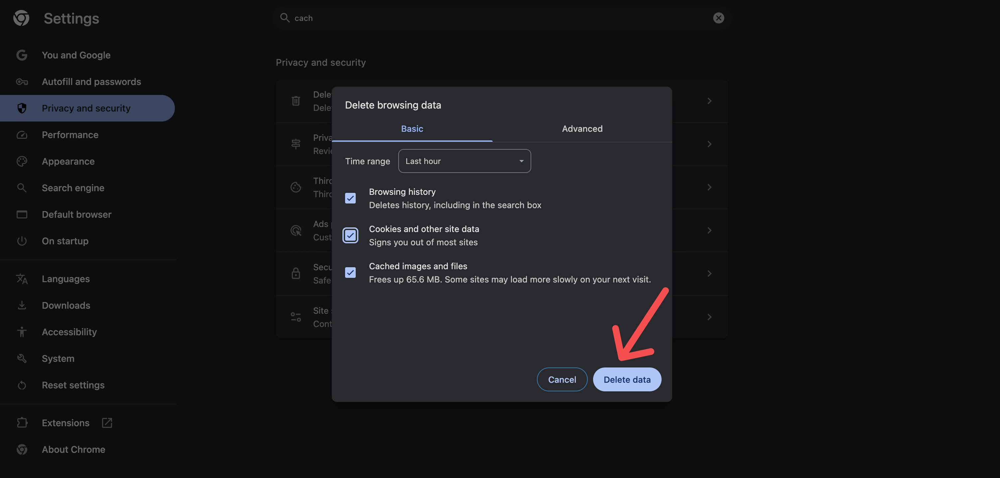

# App Starts from HomePage in Run Mode

If your app always redirects to the **HomePage** in **Run Mode**, even after a previous login, it's likely caused by **retained authentication state** or **cached session data** in your browser.

## Troubleshooting Steps

- Clear your browser cache and history.

    

- Try a different browser or use incognito/private browsing mode to see if the issue persists.

If the problem continues, consider checking your authentication flow and session management in your app settings.

:::tip[Reset Authentication State in Run Mode]
When using **Run Mode**, FlutterFlow preserves your **authentication state** across sessions. To test your app from a clean state, add a **"Log Out"** button on your HomePage that triggers the `Sign Out` action. This ensures the app starts from the login screen during your next test.
:::

