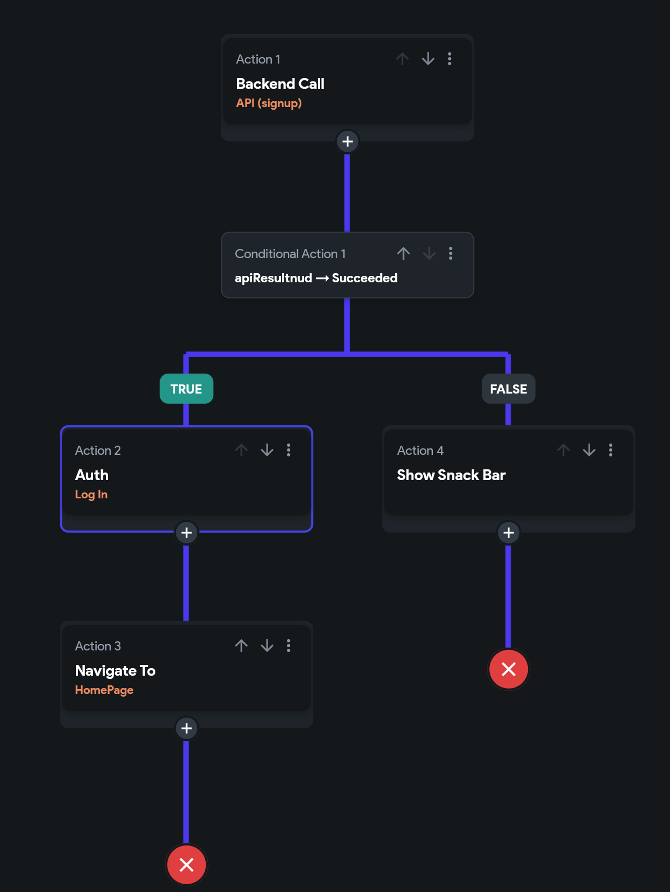
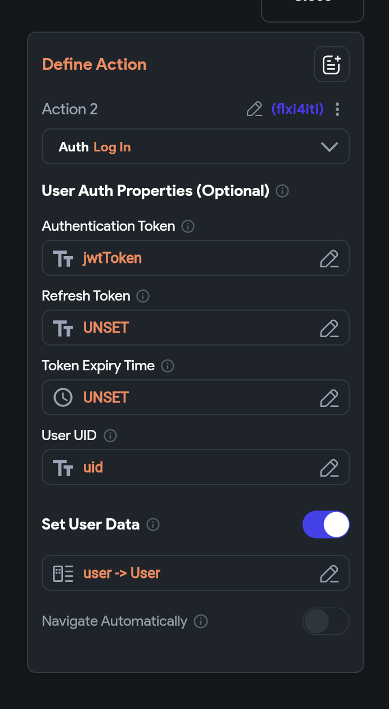

# Custom Authentication in FlutterFlow

**Pre-Requisites to Enabling Custom Authentication:**

Ensure you have a **custom server** with login and sign-up endpoints that return a JWT token upon success

**Custom authentication** must be enabled in FlutterFlow, with entry and logged-in pages correctly set

Here's an example: 

**Checklist for Troubleshooting**

**Verify Server and API Endpoints**

Confirm that your server is correctly returning JWT tokens for login and sign-up requests. The server's response should include the authentication token, refresh token, expiration time, and user ID (UID).

Double-check the API endpoint configurations in FlutterFlow to match your server's requirements.

**FlutterFlow Configuration**

Make sure custom authentication is enabled in the project settings.

Verify that the entry point and logged-in pages are set correctly.

**UI Configuration**

To facilitate the authentication flow, ensure your app has at least three pages: 

Login

Sign Up

Home Page (i.e. the landing page when a user successfully authenticates)

**API Integration and Authentication Flow**

Test API calls from FlutterFlow to your server and ensure responses are received as expected.

Upon successful authentication, use the backend FlutterFlow action to call the API. Then, utilize the response data to perform a "custom login" action within FlutterFlow.

**Handling Tokens and User Data**

Set up your FlutterFlow actions to correctly parse the API response, capturing the auth token, refresh token, expiration time, and user ID (UID). This data is crucial for managing user sessions.

**Navigation**

If automatic navigation after login or sign-up is not working, you can disable it. 

Then, opt for manual navigation to ensure users are directed to the correct page after authentication.

**General Tips**

Utilize logging both on your server and within FlutterFlow (snack bars, alerts) actions to track the authentication flow and identify any points of failure.

Test the entire authentication flow, from entering credentials to accessing protected pages after login, to ensure there are no breaks in the process.

By carefully following this guide, you should be able to troubleshoot and resolve common issues encountered when setting up custom authentication in FlutterFlow.

:::tip[Pro Tip: Use Test Credentials First]
Before integrating real user data, test your custom authentication flow using **dummy credentials** on your server. This allows you to debug token handling, API responses, and navigation logic safely—without risking user experience or exposing sensitive data.
:::

**More resources:**

https://www.youtube.com/watch?v=hnX3CvBtGvI

**Sample project:** https://app.flutterflow.io/project/custom-auth-checklist-fdjkno

https://docs.flutterflow.io/data-and-backend/custom-authentication

