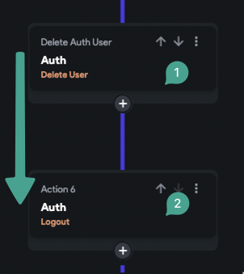
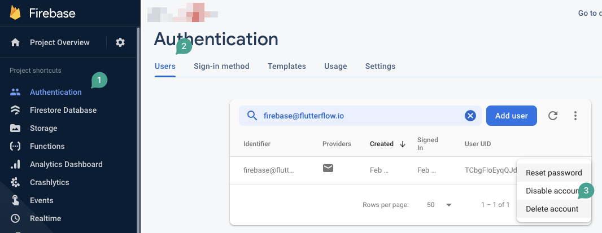

# Deleting Firebase Users and Related Data

## Understanding the Delete Action

The delete action in Firebase is designed to remove the user from the authentication table only. This means the user's document in the database will not be affected. If you want to delete the user's document from the database as well, you'll need to create a custom action with some custom code.

### Logging Out After Deletion

After completing the delete action, it is important to log out the user. Since the user no longer exists in the authentication system, logging out ensures the app routes the user back to the login page, which is typically the initial page of your project.

## Steps for Proper User Deletion

1. **Delete related data first:**  
   Before calling the delete user action, delete any related data such as Firestore documents or Storage files associated with the user. Once the user is deleted from Firebase Auth, their UID will no longer be accessible in the app session, making it difficult to reference their data afterward.

2. **Handle re-login behavior:**  
   Keep in mind that if the same user signs in again using the same signup method, Firebase will create a new document in the database for them. This happens because Firebase links the new login information to the old user document.

:::tip[Important Tips for Deleting Users]
- Always delete associated user data from Firestore or Storage **before** deleting the user from Firebase Auth. This prevents orphaned data and issues with data referencing.
- Remember that after deletion, the user will need to be logged out to avoid session errors.
- If the user signs in again with the same signup method, Firebase creates a new document for them, reconnecting the new login to the old user document.
:::

:::note
The delete user action in FlutterFlow performs the same operation as manually deleting a user from the Firebase Authentication table.
:::
