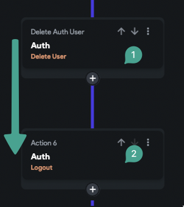
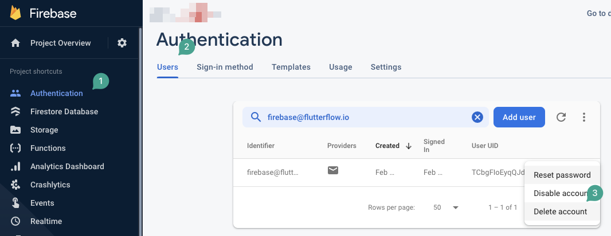

---
keywords:
  - firebase-auth
  - delete-user
  - firestore-cleanup
slug: /troubleshooting/authentication/deleting-firebase-users-and-related-data
title: Deleting Firebase Users and Related Data
description: >-
  Understanding the Delete Action The delete action in Firebase is designed to
  remove the user from the authentication table only.
tags:
  - FlutterFlow
  - Troubleshooting
  - Authentication
last_verified: 2026-09-02
---
# Deleting Firebase Users and Related Data

## Understanding the Delete Action

Deleting a Firebase Authentication user does not automatically delete that user's Firestore documents, Storage objects, or third-party records. Use a trusted server-side deletion workflow, a supported Firebase extension, or carefully authorized actions for each data store. Do not rely on client code alone to discover or delete all user data.

### Logging Out After Deletion

Firebase may require the user to have signed in recently before deleting the account. Handle `requires-recent-login` by reauthenticating the user, then retrying. After successful deletion, clear app-held user state and route to the signed-out entry page; do not keep using the old UID or token.

## Steps for Proper User Deletion

1. **Delete related data first:**
   Before deleting the Auth account, capture its UID on a trusted backend and delete or schedule deletion of the records covered by your retention policy. Make the workflow retryable and record completion without logging personal data or credentials.

2. **Handle re-login behavior:**
   If the person signs up again later, Firebase normally creates a new Auth user and UID. It does not automatically reconnect that identity to an old Firestore user document; your application must define any restoration or retention behavior explicitly.

:::tip[Important Tips for Deleting Users]
- Inventory Firestore, Storage, analytics, billing, and third-party data rather than assuming one user document is the complete record.
- Enforce authorization and reauthentication, and make partial failures safe to retry.
- Test deletion against your privacy-policy commitments, legal retention requirements, backups, and account-deletion requirements for each app store.
:::

:::note
The delete user action in FlutterFlow performs the same operation as manually deleting a user from the Firebase Authentication table.
:::

## Related documentation

See [App Starts from HomePage in Run Mode](/troubleshooting/authentication/app-starts-from-homepage-in-run-mode) for a related FlutterFlow workflow.
