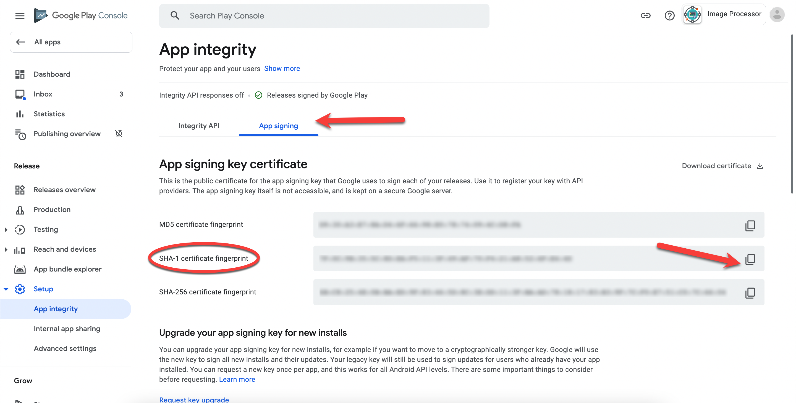
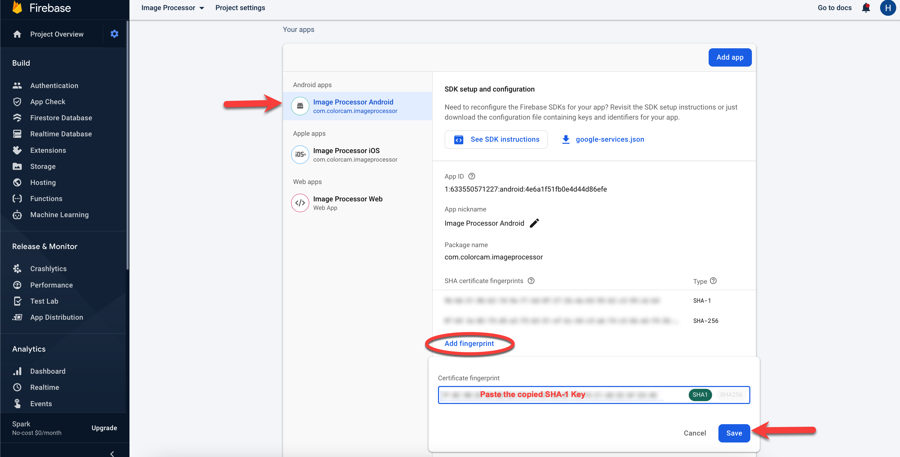
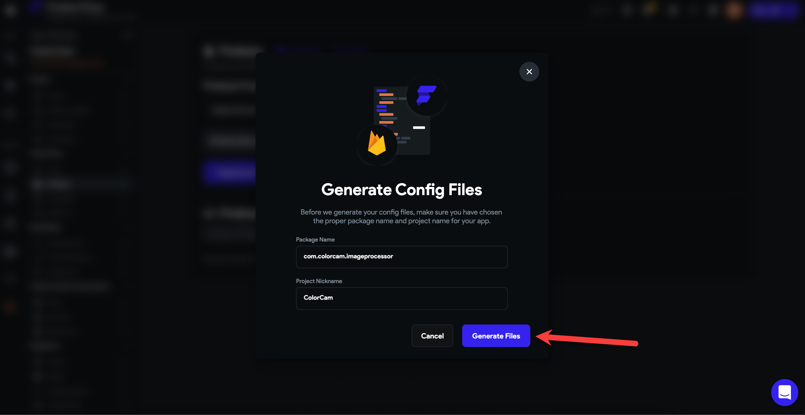

# Fix Google Sign-In Issues

If Google Sign-In isn’t working after exporting your FlutterFlow app, follow these steps based on how you’re deploying your app.

1. **If Deployed to the Play Store via CodeMagic**

    If you published your app to the Play Store using FlutterFlow's CodeMagic integration:

    - In the **Google Play Console**, open your app from the **All apps** list.
    - Go to **Setup → App Integrity**.
    - Under the **App Signing** tab, copy the **SHA-1 certificate fingerprint**.

    

    - In the **Firebase console**, open the same project, scroll to **Your Apps**, and select your Android app.
    - Click **Add fingerprint**, paste the SHA-1, then click **Save**.

    

    - In FlutterFlow, go to **Settings → Firebase** and click:
    - **Regenerate Config Files**
    - **Generate Files**

    

    Re-test your app. Google Sign-In should now work correctly.

2. **If Not Yet Published or Using Manual Signing**

    If you’re not using Play Store App Signing:

    - Use **Keytool** or **Gradle's Signing Report** to generate your SHA-1.
    - In **Firebase**, open your project settings.
    - Under **Your Apps**, select the Android app and add the SHA-1 fingerprint.

    

    - In FlutterFlow, go to **Settings → Firebase**, then:
    - **Regenerate Config Files**
    - **Generate Files**

    

    Test the app again to confirm Google Sign-In works.

    *Refer to the [Google Play Services documentation](https://developers.google.com/android/guides/overview) for more information.*

:::tip[Add Debug SHA-1 for Local Testing]
- When testing Google Sign-In in FlutterFlow before publishing, add your **debug SHA-1** in Firebase.  
- Then go to `Settings → Firebase` in FlutterFlow and regenerate your config files.
:::
