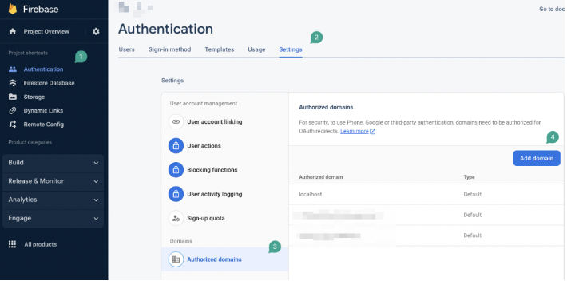

# Fix Google Sign-In for Run/Test Mode and Web Deployment

Google Sign-In and other social authentication methods may not work in **Run/Test mode** or on your **published web app** unless your domain is correctly configured in Firebase.

This is due to Firebase requiring **authorized domains** for security when handling OAuth sign-ins.

:::info[Prerequisites]
- You must have a Firebase project connected to your FlutterFlow app.
- Social authentication (e.g., Google, Facebook, Microsoft) must already be set up.
:::

Follow the steps below to add authorized domains in Firebase

1. Open your [Firebase Console](https://console.firebase.google.com) and select your project.
2. Navigate to **Authentication > Settings**.
3. Click **Authorized Domains**.
4. Click **Add Domain** and enter your app's domain. Add one or more of the following as needed:

   - For **Run Mode**:

     ```text
     app.flutterflow.io
     ```

   - For a **Published Web App**:  
     ```text
     yourapp.flutterflow.app
     ```

   - For **Test Mode Debug Sessions**:  
     Copy the domain from the "Known Issues" section in FlutterFlow or from the browser URL during test runs.

    

    

:::tip
If you are testing social login in Run/Test mode and it fails, it's likely because the test environment's domain is not added to your Firebase authorized domains.
:::

:::info [Additional Resources]
- [Set Up Google Authentication](/authentication/firebase/google-auth)
- [FlutterFlow Firebase Integration](/integrations/firebase/overview)
- [Known Limitations When Testing Web Apps](/testing/web-app-limitations)
:::
