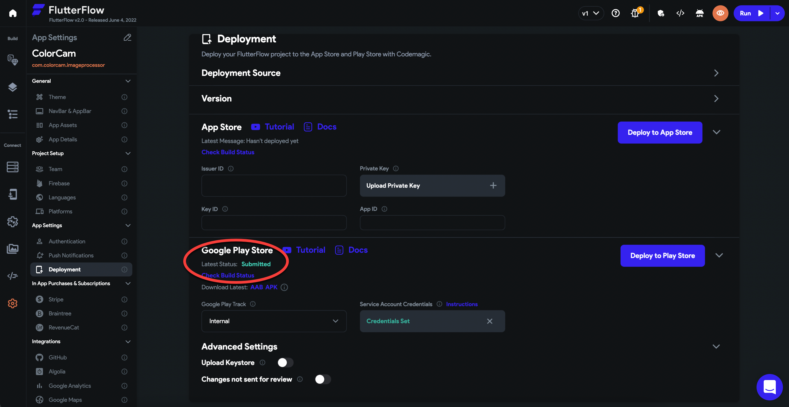
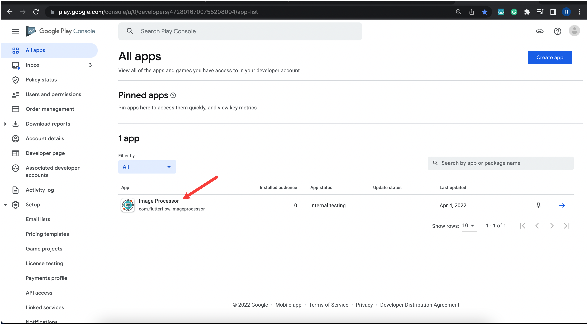
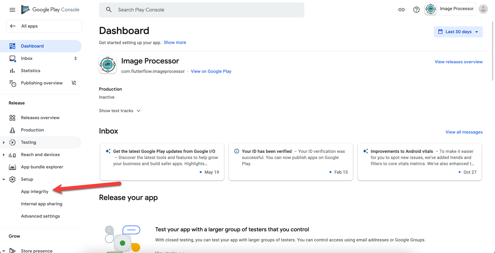
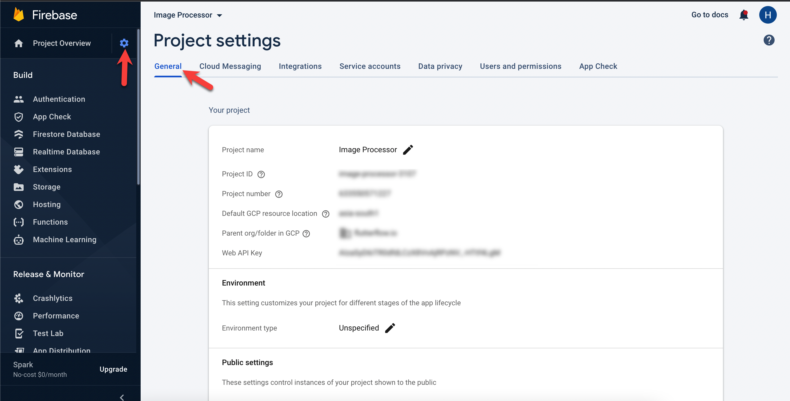

# Google Sign-In Troubleshooting

If you face any issues using the Google Sign-In feature from the exported app, follow these instructions to resolve them:

## 1. If the App is Pushed to the Play Store from FlutterFlow using CodeMagic deployment:

- Deploy your app to the Google Play Store using the CodeMagic integration in FlutterFlow.

    

- Go to the **Google Play Console**, open your app from the **All apps** list, and navigate to the **App Integrity** option under the **Setup** menu on the left.

    
    

- In the **App Integrity** section, click the **App Signing** tab and copy the **SHA-1 certificate fingerprint** using the **Copy** icon.

    

- Next, open the **Firebase console** and go to the project settings of the same project.

    

    Scroll to the **Your Apps** section, select your **Android app**, and click **Add fingerprint**. Paste the SHA-1 fingerprint and click **Save**.

    

- To update your configuration, open your app in **FlutterFlow**, go to **Settings → Firebase**, and click **Regenerate Config Files**, then click **Generate Files**.

    
    

This should resolve the issue. Re-test to confirm that Google Sign-In works as expected.

---

## 2. If You Have Not Yet Pushed to the Play Store or Are Self-Signing Your App

If you're not using Play Store App Signing or haven't deployed yet, follow our documentation to use **Keytool** or **Gradle's Signing Report** to get your SHA-1.

Once you’ve generated the SHA-1:

- Go to your **Firebase console** and open your project settings.

    

- Scroll to the **Your Apps** section, select your **Android app**, and click **Add fingerprint**. Paste the SHA-1 and click **Save**.

    

- In **FlutterFlow**, open your app and go to **Settings → Firebase**, then click **Regenerate Config Files** and **Generate Files**.

    
    

Google Sign-In should now work correctly. Re-test to confirm.

*For more information, refer to the [Google Play Services documentation](https://developers.google.com/android/guides/overview).*

---

:::tip[Add Your Debug SHA-1 for Local Google Sign-In]
If you're testing Google Sign-In inside FlutterFlow or before deploying to the Play Store, be sure to **add your debug SHA-1 fingerprint** in Firebase. Without this, authentication will fail during development.

After adding it, don’t forget to **regenerate your Firebase config files** in FlutterFlow under  
`Settings → Firebase → Regenerate Config Files → Generate Files`.
:::
