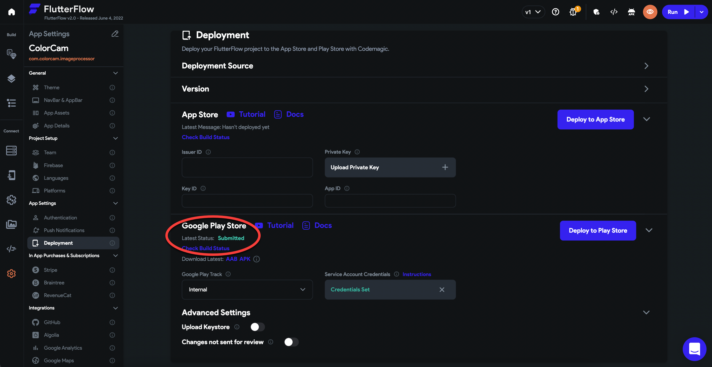
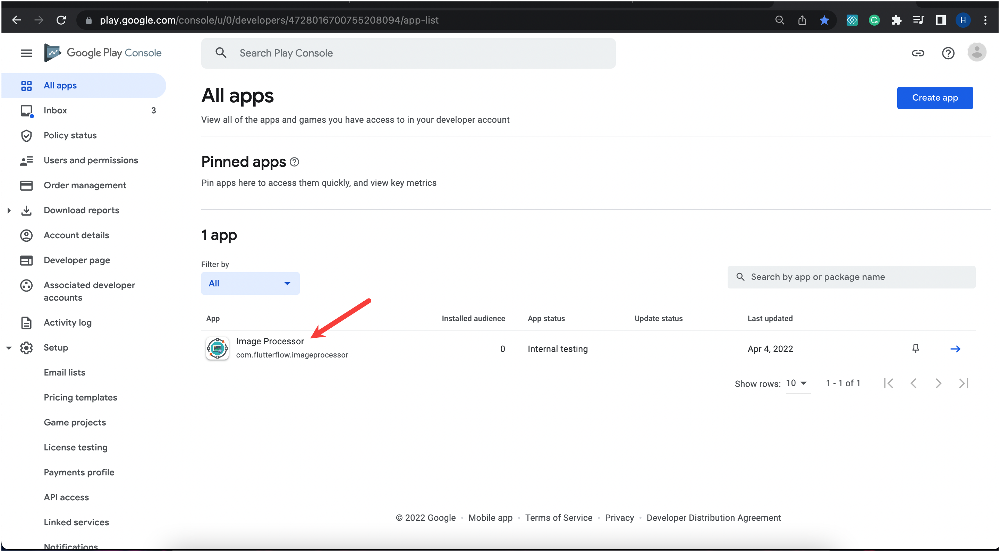
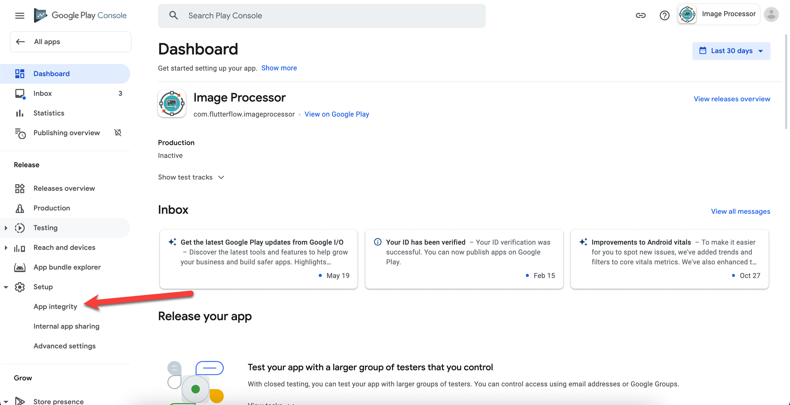
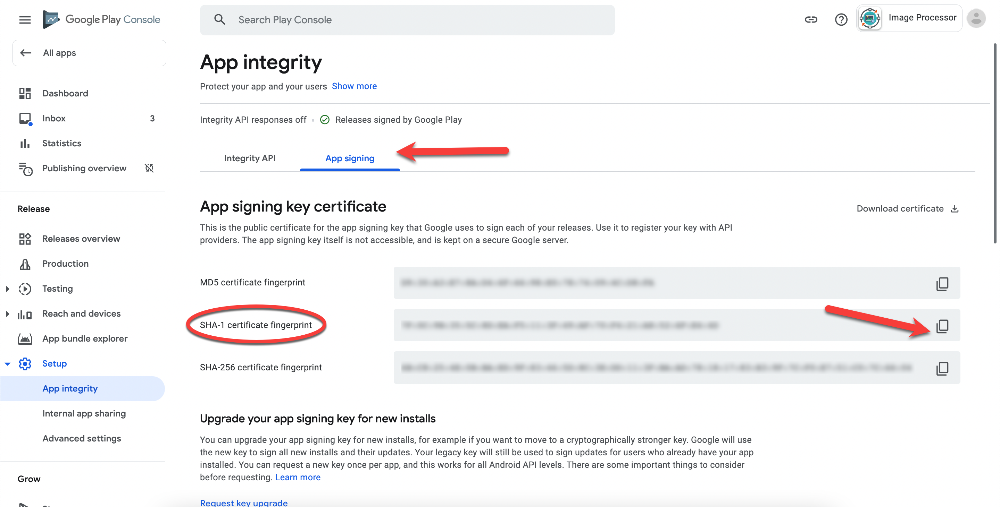
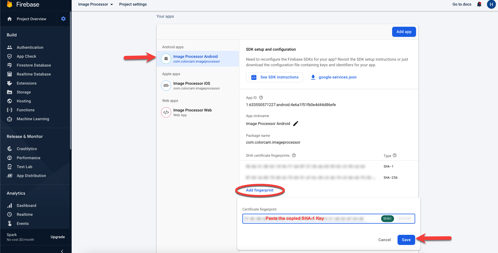
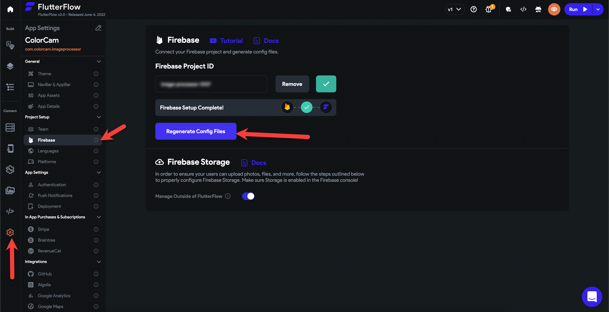
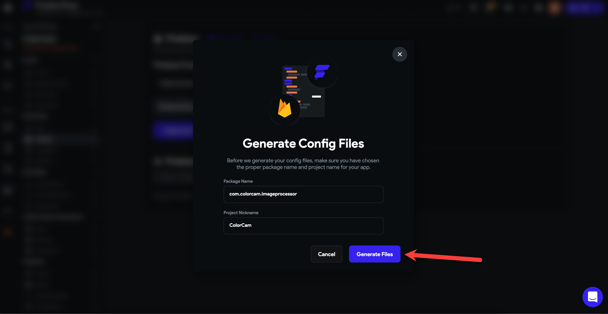

# Google Sign-In Troubleshooting

If you face any issues while using the Google Sign-in feature from the exported app, then follow the given instructions to resolve them:

**If App is Pushed to Play Store from FlutterFlow by using CodeMagic deployment:**

Deploy the application to Google Play Store by using the CodeMagic Integration in FlutterFlow.

After this step, head over to the **Google Play Console**. Here open the app from the **All apps** list.

After opening the app dashboard, click on the **App Integrity **option under the **Setup** menu present on the left side of the screen**.**

After opening the **App Integrity **section, click on the **App Signing **tab. Here you'll find the** SHA-1 certificate fingerprint. **Copy this key by clicking on the **Copy** Icon. 

After completing the above steps, head over to the **Firebase console** and open the project settings of the same project.

Here, scroll down to the find **Your Apps **section. Select the **Android app** and click on **Add fingerprint. **You'll need to paste the copied SHA-1 Fingerprint here and then hit **Save.**

After this, you'll need to Regenerate the config files from FlutterFlow. To do this, open your app in **FlutterFlow** and then click on **Settings** **&gt;** **Firebase**.

Here, Click on the **Regenerate Config Files **button and then Click on **Generate Files.**

This issue should now be resolved. You can now re-test to confirm that the issue has been fixed.
**If you have not yet pushed to the play store or are self-signing your app**
If you're not using Play Store App Signing or have not deployed yet, follow the instructions in our documentation to use Keytool or Gradle's Signing Report to get your SHA-1.

After manually generating the SHA-1 please make sure to update it in Firebase and then regenerate the config files in FlutterFlow using these instructions:

Head over to the **Firebase console** and open the project settings of your project.

Here, scroll down to the find **Your Apps **section. Select the **Android app** and click on **Add fingerprint. **You'll need to paste the copied SHA-1 Fingerprint here and then hit **Save.**

After this, you'll need to Regenerate the config files from FlutterFlow. To do this, open your app in **FlutterFlow** and then click on **Settings** **&gt;** **Firebase**.

Here, Click on the **Regenerate Config Files **button and then Click on **Generate Files.**

* *
This issue should now be resolved. You can now re-test to confirm that the issue has been fixed.​

*You can also refer to the **Google Play Services** documentation for more information.*

:::tip[Pro Tip]
If you're testing Google Sign-In inside FlutterFlow or using the app before deploying to the Play Store, make sure to **add your debug SHA-1 fingerprint** to Firebase. Without this, authentication won't work during development.

After adding it, don't forget to **regenerate your Firebase config files in FlutterFlow** under `Settings → Firebase → Regenerate Config Files → Generate Files`.
:::
